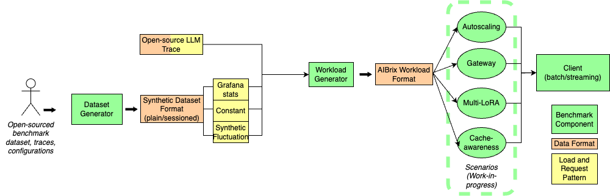
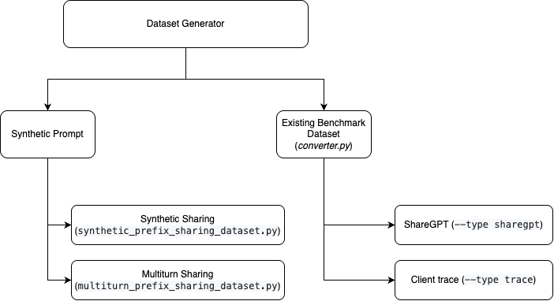
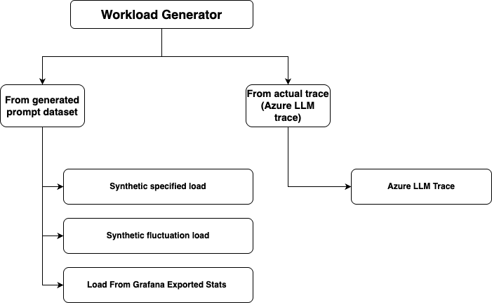
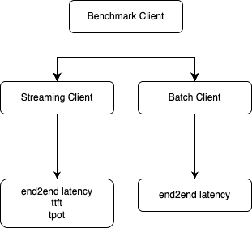

# AIBrix Benchmark

AIBrix Benchmark contains the following components:
- Dataset (Prompt) Generation
- Workload Generation
- Benchmark Client
- Benchmark Scenarios (Work-in-progress)


The diagram below shows the end-to-end steps of AIBrix benchmakrs. Our components are highlighted as green rectangles in this diagram. 


Currently, the benchmark scenarios are still under construction and the current benchmark script ```benchmark.sh``` performs all steps up to the AIBrix workload format and trigger benchmark client without extra steps setting up benchmark environment for different scenarios. 
All default shared environment variables can be found in ```config```. 


## Preliminary

Make sure you set these environment variables before you start. 

```bash
export KUBECONFIG=${kube_config_path}
kubectl -n envoy-gateway-system port-forward ${service_name} 8888:80 &
export api_key="${your_api_key}"
```


## Run benchmark end-to-end
To run all steps using the default setting, try

```bash
./benchmark.sh all
```

Each steps can also be run separately. 

## Run dataset generator

As shown in the diagram above, the workload generator would expect would accept either a time-series traces (e.g., Open-source LLM trace, Grafana exported time-series metrics, see this for more details) or synthetic prompt file which could be hand-tuned by users (i.e., synthetic dataset format). 
A synthetic dataset format need to be in one of the two formats:

1. Plain format (no sessions)
```json
{"prompt": "XXXX"}
{"prompt": "YYYY"}
```
2. Session format
```json
{"session_id": 0, "prompts": ["XXX", "YYY"]}
{"session_id": 1, "prompts": ["AAA", "BBB", "CCC"]}
```
The dataset generator either generates a prompt dataset, or convert an existing dataset which belongs to one of the two formats above. 


To run dataset generation, do
```bash
./benchmark.sh dataset
```

Currently, we support four types of dataset:

**1. Controlled Synthetic Sharing**
- This type allows users to generate a cache sharing *plain-format* dataset with *controlled prompt token length* and *controlled prefix sharing length*, as well as controlled number of prefixes (i.e., sessions). To tune the prompt token length and shared length, set environment variables in [config/dataset/synthetic_shared.sh](./config/dataset/synthetic_shared.sh).

**2. Multiturn Synthetic**
- Multiturn synthetic data generation produces *sessioned-format* dataset. Each session id maps to *controlled number of prompts* per session and *controlled prompt lengths*. These variables could be tuned via [config/dataset/synthetic_multiturn.sh](./config/dataset/synthetic_multiturn.sh). 

**3. ShareGPT**
- This generation type converts ShareGPT dataset to *sessioned-format* dataset that has session_id, prompts and completions. Configure via [config/dataset/sharegpt.sh](./config/dataset/sharegpt.sh).

**4. Client trace**
- This generation type converts client output into a *plain-format* dataset. Configure via [config/dataset/client_trace.sh](./config/dataset/client_trace.sh).

The first two types generate synthetic prompts and the second two types convert external data sources/benchmark data. 



For details of dataset generator, check out [README](./generator/dataset-generator/README.md). All tunable parameters are set under ```config/dataset```.


## Run workload generator
Workload generator specifies time and requests to be dispatched of a workload. A workload generator accepts either a trace/metrics files (where either time and requests are specified, or QPS/input/output volume are specified) or a synthetic dataset format that contains prompts and possibly session. There are different ways to use workload generator. 




**1. The "constant" and "synthetic" workload type**
- Workload generator could generate two types of *synthetic load patterns*. Where multiple workload configurations can be hand-tuned (e.g., traffic/QPS distribution, input request token lengths distribution, ouput token lengths distribution, maximum concurrent sessions, etc.):
    - Constant load (**constant**): The mean load (QPS/input length/output length) stays constant with controallable fluctuation. Configure this type via [config/workload/constant.sh](config/workload/constant.sh).
    - Synthetic fluctuation load (**synthetic**): The loads (QPS/input length/output length) flucatuate based on configurable parameters. Configure this type via [config/workload/synthetic.sh](config/workload/synthetic.sh).

**2. The "stat" workload type**
- For *metrics file (e.g., .csv file exported from Grafana dashboard)*, the workload generator will generate the QPS/input length/output length distribution that follows the collected time-series metrics specified in the file. The actual prompt used in the workload, will be based on one of the synthetic dataset generated by the [dataset generator](#run-dataset-generator). 


**3. The "azure" workload type**
- For a trace (e.g., Azure LLM trace), both the requests and timestamp associated with the requests are provided, and the workload generator will generate a workload that simply replay requests based on the timestamp. Configure this type via [config/workload/azure.sh](config/workload/azure.sh).


Workload generator could be run by:
```bash
./benchmark.sh workload
```

Ths workload generator would produce a workload file that looks like the following. The logical timestamp is associated with list of prompts that need to be dispatched at the same time. 

```json
{
    "timestamp": 19, 
    "requests": 
    [
        {
            "prompt": "I need to understand data science for my startup idea. Can you help? Could you also explain how this relates to natural language processing? For context, I have experience with cybersecurity but I'm new to this specific area. I've been trying to understand this concept for months and would appreciate a clear explanation. I'm asking because I need to deploy a machine learning model for a project. For context, I have experience with cryptocurrency but I'm new to this specific area. Could you", 
            "prompt_length": 101, 
            "output_length": null,
            "session_id": 0
        },
        {
            "prompt": "...."
            ......
        }
    ]
}
```

Details of workload generator could be found [here](generator/workload-generator/README.md).


## Run workload using client
```bash
./benchmark.sh client
```

The benchmark client supports both batch and streaming mode. Streaming mode  supports intra-request metrics like TTFT/TPOT. Configure endpoint and target model via [config/base.sh](config/base.sh).



## Run analysis

Run analysis on benchmark result using: 
```bash
./benchmark.sh analysis
```
Configure path and performance target via [config/base.sh](config/base.sh).


