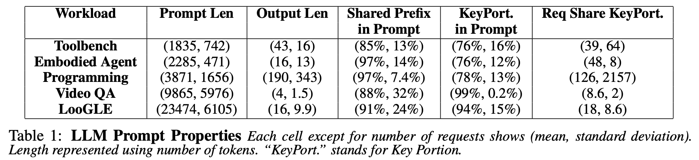

# Using Dataset Generator


## Generate Synthetic Dataset 
### Generate Synthetic Prefix-sharing Dataset

We support generating synthetic prefix-sharing dataset with controlled prompt length (mean and standard deviation) and shared prompt percentages (mean and standard deviation). For example:

```shell
NUM_PREFIX=10
NUM_SAMPLES=200
## Toolbench Workload
python synthetic_prefix_sharing_dataset.py --app-name programming --prompt-length 1835 --prompt-length-std 742 --shared-proportion 0.85 --shared-proportion-std 0.13 --num-samples-per-prefix ${NUM_SAMPLES} --num-prefix ${NUM_PREFIX} --randomize-order

## Embodied Agent Workload
python synthetic_prefix_sharing_dataset.py --app-name programming --prompt-length 2285 --prompt-length-std 471 --shared-proportion 0.97 --shared-proportion-std 0.14 --num-samples-per-prefix ${NUM_SAMPLES} --num-prefix ${NUM_PREFIX} --randomize-order

## Programming Workload
python synthetic_prefix_sharing_dataset.py --app-name programming --prompt-length 3871 --prompt-length-std 1656 --shared-proportion 0.97 --shared-proportion-std 0.074 --num-samples-per-prefix ${NUM_SAMPLES} --num-prefix ${NUM_PREFIX} --randomize-order

## Video QA Workload
python synthetic_prefix_sharing_dataset.py --app-name programming --prompt-length 9865 --prompt-length-std 5976 --shared-proportion 0.88 --shared-proportion-std 0.32 --num-samples-per-prefix ${NUM_SAMPLES} --num-prefix ${NUM_PREFIX} --randomize-order

## LooGLE Workload
python synthetic_prefix_sharing_dataset.py --app-name programming --prompt-length 23474 --prompt-length-std 6105 --shared-proportion 0.91 --shared-proportion-std 0.24 --num-samples-per-prefix ${NUM_SAMPLES} --num-prefix ${NUM_PREFIX} --randomize-order
```

This will generate a .jsonl file that contains collection of prompt to serve as input to the workload generator. 

The commands above simulate a cache sharing scheme for programming workload described in [Preble](https://arxiv.org/pdf/2407.00023), as shown below:


In general, the ```synthetic_prefix_sharing_dataset.py ``` creates synthetic dataset that simulate controlled prompt lengths distribution and sharing lengths. Here ```--num-prefix``` is the number of unique shared contexts appeared in the dataset and ```--num-samples-per-prefix``` is the number of prompts sampled on each shared context. 


### Generate Synthetic Multi-turn Conversation Dataset
We also support generating synthetic multi-turn conversation. Here you can control the prompt length (mean and standard deviation), number of turns (mean and standard deviation) and prompt length (mean and standard deviation). For example:

```shell
python multiturn_prefix_sharing_dataset.py \
    --prompt-length-mean 100 \
    --prompt-length-std 10 \
    --num-turns-mean 10 \
    --num-turns-std 1 \
    --num-sessions-mean 10 \
    --num-sessions-std 1
```
This will generate a .jsonl file that contains collection of sessioned prompts. to serve as input to the workload generator. The prompts within the same session will be played at the same order as appeared in the dataset. 


## Convert client traces to dataset

We can convert ```output.jsonl```, which contains both prompt and completion from a previous run, to prompt file like the following:
```shell
export TRACE="output.jsonl"
python converter.py \
    --path ${TRACE} \
    --type trace \
    --tokenizer deepseek-ai/deepseek-llm-7b-chat
```


## Convert ShareGPT dataset

We can convert existing dataset to a sessioned prompt output like the following. For example, download ShareGPT dataset:

```shell
export TARGET_DATASET="/tmp/ShareGPT_V3_unfiltered_cleaned_split.json"
wget https://huggingface.co/datasets/anon8231489123/ShareGPT_Vicuna_unfiltered/resolve/main/ShareGPT_V3_unfiltered_cleaned_split.json -O ${TARGET_DATASET}
```

... convert dataset like 

```shell
python converter.py  \
    --path ${TARGET_DATASET} \
    --type sharegpt \
    --tokenizer deepseek-ai/deepseek-llm-7b-chat
```
We will extend the converter to other dataset beyond ShareGPT. Stay tuned!