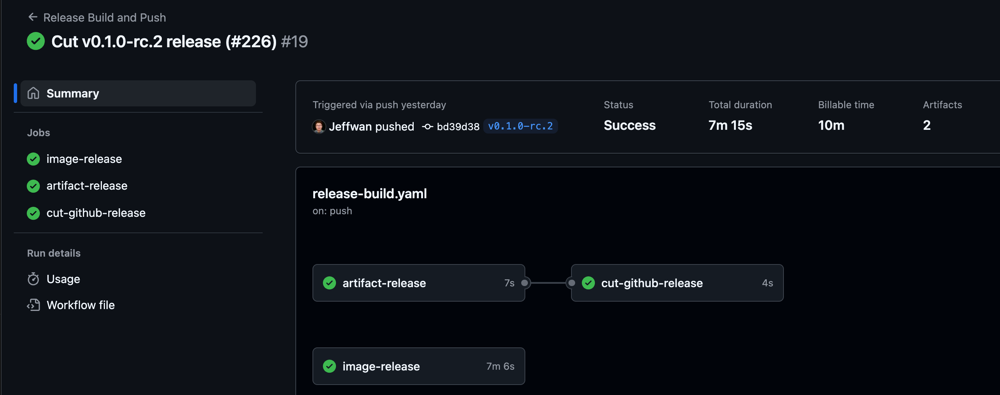
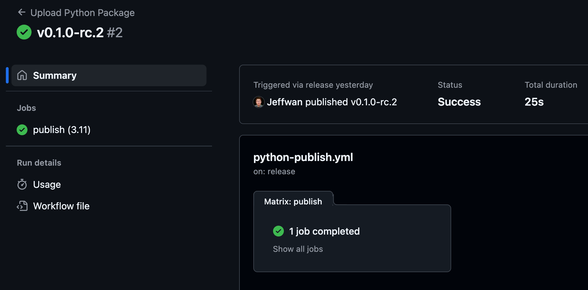
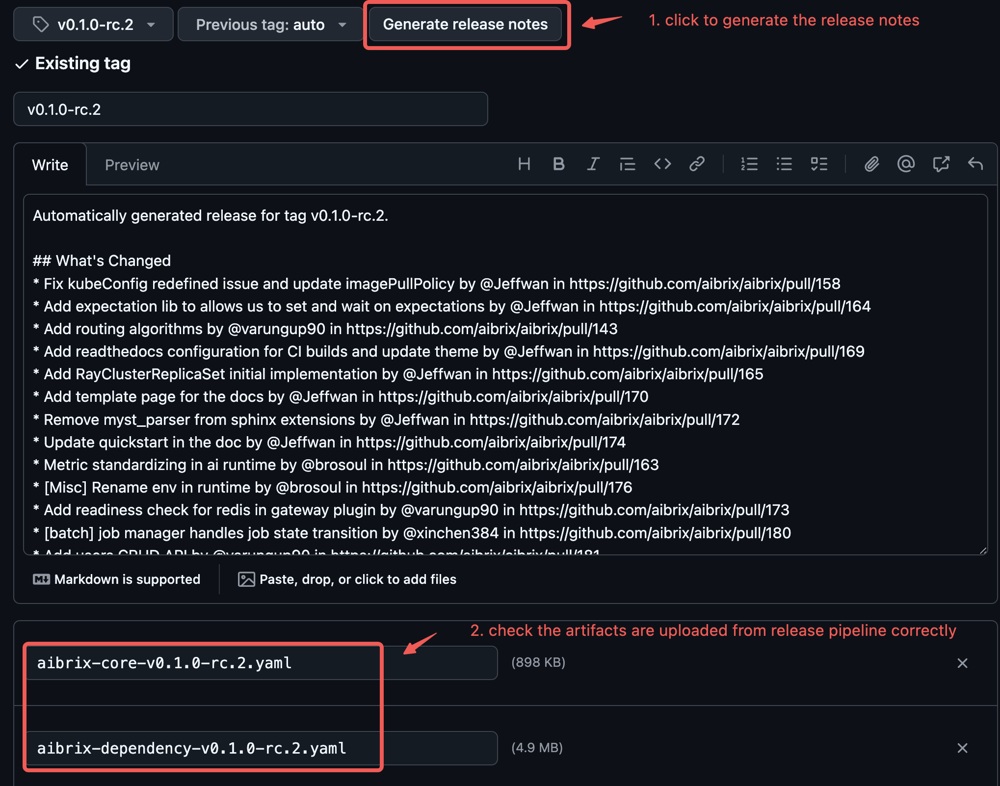

.. _release:

=======
Release
=======

.. note::
    This document is for release team only. Feel free to skip it.

This process outlines the steps required to create and publish a release for AIBrix Github project.
Follow these steps to ensure a smooth and consistent release cycle.

1. Prepare the code
-----------------------------

Option 1 minor version release
^^^^^^^^^^^^^^^^^^^^^^^^^^^^^^

For new minor version release like ``v0.1.0``, please checkout a new branch named ``release-0.1``.

.. code-block:: bash

    git checkout -b release-0.1 # cut from main branch
    git fetch origin main
    git rebase origin/main
    git push origin release-0.1

.. note::
    If origin doesn't points to upstream, let's say you fork the remote, ``upstream`` or other remotes should be right remote to push to.

Option 2: patch version release
^^^^^^^^^^^^^^^^^^^^^^^^^^^^^^^

For patch version like ``v0.1.1``, please reuse the release branch ``release-0.1``, it should be created earlier from the minor version release.
for patch release, we do not rebase ``main`` because it will introduce new features. All fixes have to be cherry-picked or cut PR against ``release-0.1`` directly.

.. code-block:: bash

    git checkout release-0.1
    git fetch origin
    git rebase origin/release-0.1

    # not need to push, it should be update to date.

Cut a PR
--------

Make sure the manifest images tags and updated and python version is updated. A sample PR is `Cut v0.1.0-rc.3 release <https://github.com/aibrix/aibrix/pull/280>`_.
Merge the PR.

.. note::
    container image actually is not built yet, we preserve the tag name and it would be built later once the tag is created.

Create the tag and push to remote
---------------------------------

.. code-block:: bash

    # make sure you fetch the earlier PR locally
    git fetch origin release-0.1
    git rebase origin/release-0.1

    # create the tag
    git tag v0.1.0

    # push the tag
    git push origin v0.1.0

Monitor the release pipeline
----------------------------

After pushing the tag, the release pipeline (e.g., CI/CD workflows) should automatically begin. This may include:
- Running tests and validations
- Building manifest artifacts
- Building container image and push to the registry
- Building python library and upload to PyPI

Monitor the pipeline's progress to ensure it completes successfully

Publish the release on Github
-----------------------------

Release pipeline will cut a draft pre-release in `Github Releases <https://github.com/aibrix/aibrix/releases>`_.
Go to the "Releases" section in the repository, select the draft release corresponding to the tag you created.
Include release notes summarizing the changes (new features, bug fixes, breaking changes, etc.).
Optionally attach binaries, documentation, or other assets. In the end, let's publish the release.

Sync images to Volcano Engine Container Registry
------------------------------------------------

Currently, release pipeline only push images to dockerhub. In order to use them in VKE,
we need to retag the images and push to VKE Container Registry.

.. note::
    It requires you to use a machine that have both VKE and Dockerhub access.
    Do not forget to get the temporary credential and login the registry service before pushing.

.. code-block:: bash

    ./hack/sync-images.sh v0.1.0-rc.3 aibrix-container-registry-cn-beijing.cr.volces.com
    ./hack/sync-images.sh v0.1.0-rc.3 aibrix-container-registry-cn-shanghai.cr.volces.com
