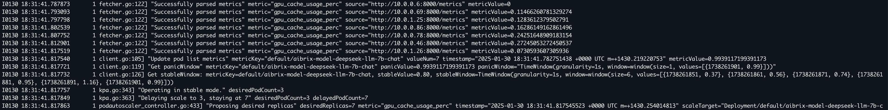
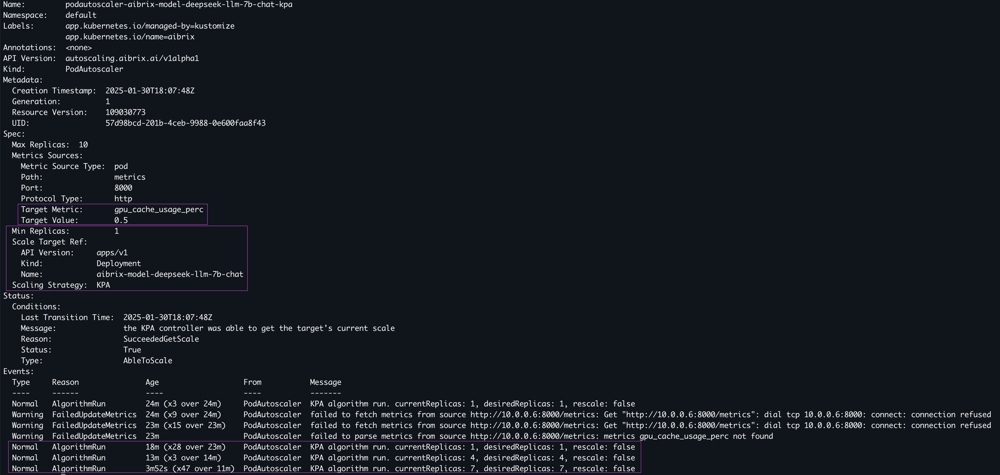
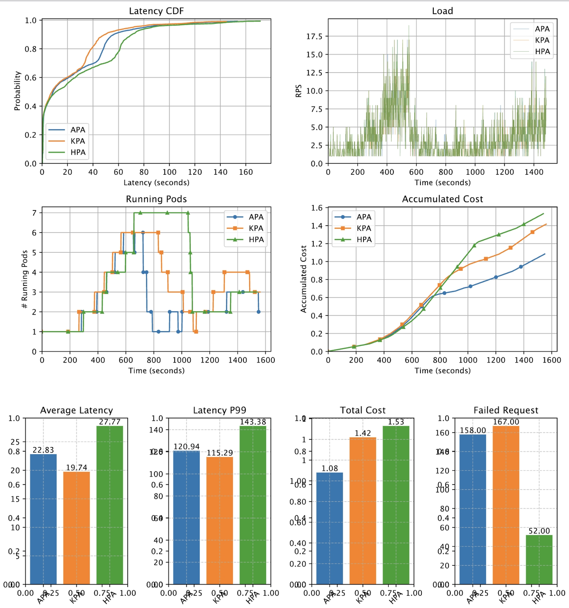

.. _autoscaling:

===========
Autoscaling
===========

Overview of AIBrix Autoscaler
-----------------------------

Autoscaling is crucial for deploying Large Language Model (LLM) services on Kubernetes (k8s), as timely scaling up handles peaks in request traffic, and scaling down conserves resources when demand wanes.

AIBrix Autoscaler includes various autoscaling components, allowing users to conveniently select the appropriate scaler. These options include the Knative-based Kubernetes Pod Autoscaler (KPA), the native Kubernetes Horizontal Pod Autoscaler (HPA), and AIBrix’s custom Advanced Pod Autoscaler (APA) tailored for LLM-serving.

In the following sections, we will demonstrate how users can create various types of autoscalers within AIBrix.

1. Supported autoscaler mechanism
    - HPA: it is same as vanilla K8s HPA.
        - HPA, the native Kubernetes autoscaler, is utilized when users deploy a specification with AIBrix that calls for an HPA. This setup scales the replicas of a demo deployment based on CPU utilization.
    - KPA: it is from KNative. KPA has panic mode which scales up more quickly based on short term history. More rapid scaling is possible
        - The KPA, inspired by Knative, maintains two time windows: a longer ``stable window`` and a shorter ``panic window``. It rapidly scales up resources in response to sudden spikes in traffic based on the panic window measurements. Unlike other solutions that might rely on Prometheus for gathering deployment metrics, AIBrix fetches and maintains metrics internally, enabling faster response times. Example of a KPA scaling operation using a mocked vllm-based Llama2-7b deployment
    - APA: same as HPA but it has fluctuation parameter which acts as minimum buffer before triggering scaling up and down to prevent oscillation.
        - While HPA and KPA are widely used, they are not specifically designed and optimized for LLM serving, which has distinct optimization points. AIBrix's custom APA (AIBrix Pod Autoscaler) solution will gradually introduce features such as:
        1. Selecting appropriate metrics for scaling based on AI Runtime metrics standardization, allowing autoscaling across various LLM-serving engines (e.g., vllm, hgi, triton) based on LLM-specific metrics.
        2. For users with heterogeneous GPU resources, combining LLM and GPU features.
        3. Implementing a proactive scaling algorithm rather than a reactive one.

2. Metrics
    - AiBrix suports all the vllm metrics. Please refer to https://docs.vllm.ai/en/stable/serving/metrics.html

How to deploy an autoscaler
--------------
It is simply applying podautoscaler yaml file.
One important thing you should note is that the deployment name and the name in scaleTargetRef in PodAutoscaler must be same. 
That's how AiBrix PodAutoscaler refers to the right deployment.

All the sample files can be found in the following directory. 

.. code-block:: bash
    
    root/samples/autoscaling

Example HPA yaml config

.. code-block:: yaml

    apiVersion: autoscaling.aibrix.ai/v1alpha1
    kind: PodAutoscaler
    metadata:
    name: podautoscaler-aibrix-model-deepseek-llm-7b-chat-hpa
    namespace: default
    labels:
        app.kubernetes.io/name: aibrix
        app.kubernetes.io/managed-by: kustomize
    spec:
    scalingStrategy: "HPA"
    minReplicas: 1
    maxReplicas: 10
    metricsSources:
    - metricSourceType: "pod"
        protocolType: "http"
        port: "8000"
        path: "/metrics"
        targetMetric: "gpu_cache_usage_perc"
        targetValue: "50"
    scaleTargetRef:
        apiVersion: apps/v1
        kind: Deployment
        name: aibrix-model-deepseek-llm-7b-chat

Example KPA yaml config

.. code-block:: yaml

    apiVersion: autoscaling.aibrix.ai/v1alpha1
    kind: PodAutoscaler
    metadata:
    name: podautoscaler-aibrix-model-deepseek-llm-7b-chat-kpa
    namespace: default
    labels:
        app.kubernetes.io/name: aibrix
        app.kubernetes.io/managed-by: kustomize
        kpa.autoscaling.aibrix.ai/scale-down-delay: "3m"
    spec:
    scalingStrategy: KPA
    minReplicas: 1
    maxReplicas: 10
    metricsSources:
    - metricSourceType: pod
        protocolType: http
        port: "8000"
        path: metrics
        targetMetric: gpu_cache_usage_perc
        targetValue: "0.5"
    scaleTargetRef:
        apiVersion: apps/v1
        kind: Deployment
        name: aibrix-model-deepseek-llm-7b-chat

Example APA yaml config

.. code-block:: yaml

    apiVersion: autoscaling.aibrix.ai/v1alpha1
    kind: PodAutoscaler
    metadata:
    name: podautoscaler-aibrix-model-deepseek-llm-7b-chat-apa
    namespace: default
    labels:
        app.kubernetes.io/name: aibrix
        app.kubernetes.io/managed-by: kustomize
        autoscaling.aibrix.ai/up-fluctuation-tolerance: "0.1"
        autoscaling.aibrix.ai/down-fluctuation-tolerance: "0.2"
        apa.autoscaling.aibrix.ai/window: "30s"
    spec:
    scalingStrategy: "APA"
    minReplicas: 1
    maxReplicas: 10
    metricsSources:
    - metricSourceType: pod
        protocolType: http
        port: "8000"
        path: metrics
        targetMetric: "gpu_cache_usage_perc"
        targetValue: "0.5"
    scaleTargetRef:
        apiVersion: apps/v1
        kind: Deployment
        name: aibrix-model-deepseek-llm-7b-chat

Related log check
----------------

AiBrix controller manager collects the metrics from each pod. 
.. code-block:: bash
    
    kubectl logs <aibrix-controller-manager-podname>  -n aibrix-system -f

Expected log output. You can see the current metric is gpu_cache_usage_perc. You can check each pod's current metric value.

To describe the podautoscaler 
.. code-block:: bash

    kubectl describe podautoscaler <podautoscaler-name> -n <namespace>

Example output

Preliminary experiments with different autoscalers
--------------------------------------------------

Here we show the preliminary experiment results to show how different autoscaling mechanism and configuration for autoscaler affect the performance(latency) and cost(compute cost).
In AiBrix, user can easily deploy different autoscaler by simply applying k8s yaml.

- Set up
    - Model: Deepseek 7B chatbot model
    - GPU type: V100
    - Max number of GPU: 8
- Target metric and value
    - Target metric: gpu_kv_cache_utilization
    - Target value: 50%
- Workload
    - The overall RPS trend starts with low RPS and goes up relatively fast until T=500 to evaluate how different autoscaler and config reacts to the rapid load increase. After that, it goes down to low RPS quickly to evaluate scaling down behavior and goes up again slowly.
        - Average RPS trend: 1 RPS -> 4 RPS -> 8 RPS -> 10 RPS -> 2 RPS -> 6 RPS
    - RPS can be found in the second subfigure.
- Performance
    - HPA has the highest latency since its slow reaction. KPA is the most reactive with panic mode. APA was running with small delay window to save cost. It does save cost but ends up having higher latency than KPA when it scales down too aggressively from T=700 to T=1000. 
- Cost
    - The fourth figure shows the relative accumulated compute cost over time. The accumulated cost is calculated by multiplying the time by unit cost (in this example, 1). The actual compute cost can be calculated by multiplying the actual cost per unit time.
    - HPA is the most expensive due to the longer delay window for scaling down.
    - APA is the most responsive and saves the cost most. You can see it fluctuating more than other two autoscalers.
    - Note that scaling down window is not inherent feature of each autoscaling mechanism. It is configurable variable. We use the default value for HPA (300s).
- Conclusion
    - There is no one autoscaler that outperforms others for all metrics (latency, cost). In addition, the results might depend on the workloads. Infrastructure should provide easy way to configure whichever autoscaling mechanism they want and should be easily configurable since different users have different preference. For example, one might prefer cost over performance or vice versa. 

