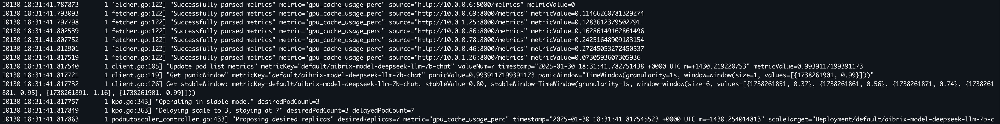
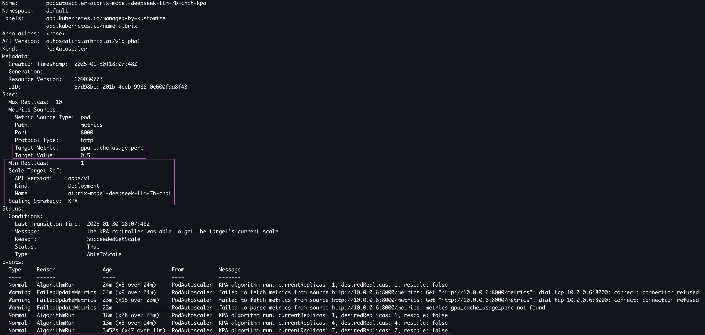
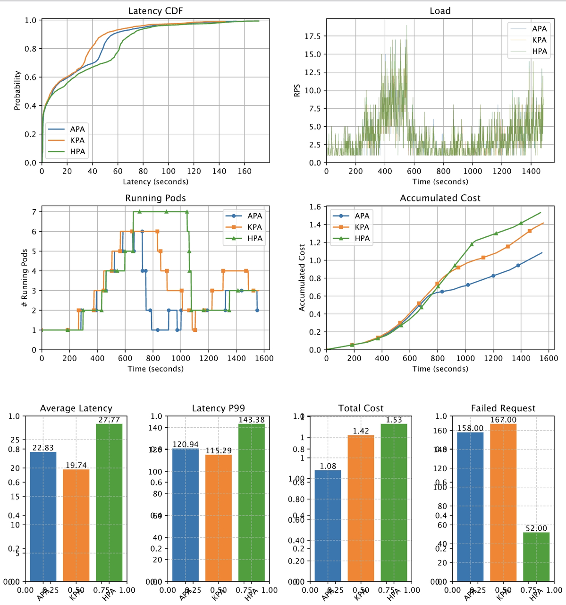

.. _metric-based-autoscaling:

===========================
Metric-based Autoscaling
===========================

AIBrix Autoscaler includes various metric-based autoscaling components, allowing users to conveniently select the appropriate scaler. These options include the Knative-based Kubernetes Pod Autoscaler (KPA), the native Kubernetes Horizontal Pod Autoscaler (HPA), and AIBrix’s custom Advanced Pod Autoscaler (APA) tailored for LLM-serving.

In the following sections, we will demonstrate how users can create various types of autoscalers within AIBrix.

Supported Autoscaling Mechanism
-------------------------------

- HPA: it is same as vanilla K8s HPA. HPA, the native Kubernetes autoscaler, is utilized when users deploy a specification with AIBrix that calls for an HPA. This setup scales the replicas of a demo deployment based on CPU utilization.
- KPA: it is from Knative. KPA has panic mode which scales up more quickly based on short term history. More rapid scaling is possible. The KPA, inspired by Knative, maintains two time windows: a longer ``stable window`` and a shorter ``panic window``. It rapidly scales up resources in response to sudden spikes in traffic based on the panic window measurements. Unlike other solutions that might rely on Prometheus for gathering deployment metrics, AIBrix fetches and maintains metrics internally, enabling faster response times. Example of a KPA scaling operation using a mocked vllm-based Llama2-7b deployment
- APA: similar as HPA but it has fluctuation parameter which acts as minimum buffer before triggering scaling up and down to prevent oscillation.

While HPA and KPA are widely used, they are not specifically designed and optimized for LLM serving, which has distinct optimization points. AIBrix's custom APA (AIBrix Pod Autoscaler) solution will gradually introduce features such as:

- Selecting appropriate LLM-specific metrics for scaling based on AI Runtime metrics standardization.
- Proactive scaling algorithm rather than a reactive one. (WIP)
- Profiling & SLO driven autoscaling solution. (Testing Phase)

Metrics
-------

AiBrix supports all the vllm metrics. Please refer to https://docs.vllm.ai/en/stable/design/metrics.html

How to deploy autoscaling policy
--------------------------------

It is simply applying PodAutoscaler yaml file.
One important thing you should note is that the deployment name and the name in `scaleTargetRef` in PodAutoscaler must be same.
That's how AiBrix PodAutoscaler refers to the right deployment.

All the sample files can be found in the following directory. 

.. code-block:: bash
    
    https://github.com/vllm-project/aibrix/tree/main/samples/autoscaling

Example HPA yaml config
^^^^^^^^^^^^^^^^^^^^^^^

.. literalinclude:: ../../../../samples/autoscaling/hpa.yaml
   :language: yaml

Example KPA yaml config
^^^^^^^^^^^^^^^^^^^^^^^

.. literalinclude:: ../../../../samples/autoscaling/kpa.yaml
   :language: yaml

Configurable metric windows
^^^^^^^^^^^^^^^^^^^^^^^^^^^

``PodAutoscaler`` supports optional metric window fields under ``spec``. These
fields control how much recent metric history the autoscaler keeps for scaling
decisions.

.. list-table::
   :header-rows: 1
   :widths: 28 16 16 48

   * - Field
     - Default
     - Valid range
     - Description
   * - ``observeWindowSeconds``
     - ``180``
     - ``1`` to ``3600``
     - Stable metric window used for regular scaling recommendations. Increase
       it to smooth noisy metrics; decrease it to make the autoscaler react
       faster to recent load changes.
   * - ``panicWindowSeconds``
     - ``60``
     - ``1`` to ``3600``
     - Short metric window used by KPA panic-mode decisions. It must be less
       than or equal to ``observeWindowSeconds``.

If either field is omitted, AIBrix uses the default value above. Validation
rejects non-positive values, values greater than ``3600``, and configurations
where ``panicWindowSeconds`` is greater than ``observeWindowSeconds``. This
comparison uses defaults for omitted fields, so setting
``observeWindowSeconds`` below ``60`` also requires setting
``panicWindowSeconds`` to the same or a smaller value.

Example KPA policy with a 10-minute stable window and a 1-minute panic window:

.. code-block:: yaml

   apiVersion: autoscaling.aibrix.ai/v1alpha1
   kind: PodAutoscaler
   metadata:
     name: example-kpa-windows
   spec:
     scalingStrategy: KPA
     minReplicas: 1
     maxReplicas: 8
     observeWindowSeconds: 600
     panicWindowSeconds: 60
     metricsSources:
       - metricSourceType: pod
         protocolType: http
         port: "8000"
         path: metrics
         targetMetric: gpu_cache_usage_perc
         targetValue: "0.5"
     scaleTargetRef:
       apiVersion: apps/v1
       kind: Deployment
       name: deepseek-r1-distill-llama-8b

Scheduled replica bounds
^^^^^^^^^^^^^^^^^^^^^^^^

``PodAutoscaler`` supports optional scheduled replica bounds under
``spec.schedules``. Each entry defines a recurring daily wall-clock window with
``startTime`` and ``endTime`` in strict zero-padded ``HH:MM`` format. The start
time is inclusive and the end time is exclusive. While active, a schedule
overrides the base ``spec.minReplicas`` and/or ``spec.maxReplicas``.

If ``timezone`` is omitted, schedules are evaluated in UTC. When set,
``timezone`` must be a valid IANA timezone such as
``America/Los_Angeles``. If ``daysOfWeek`` is omitted, the schedule applies
every day. When set, ``daysOfWeek`` accepts English three-letter weekday names
such as ``Mon`` through ``Sun``.

Scheduled entries may set either ``minReplicas``, ``maxReplicas``, or both. A
partial override inherits the missing bound from the base PodAutoscaler spec.
Validation rejects entries that do not set either bound, produce an effective
minimum greater than the effective maximum, use invalid timezones or invalid
time formats, span midnight, or overlap with another scheduled bounds entry.
Overlapping windows are rejected instead of relying on implicit priority.

HPA, KPA, and APA all use the effective scheduled bounds. For HPA strategy,
AIBrix writes the effective bounds to the generated Kubernetes
``HorizontalPodAutoscaler``. If the effective minimum is ``0``, the generated
HPA omits ``spec.minReplicas`` to preserve the existing Kubernetes HPA
compatibility behavior.

Example APA policy with weekday business-hour bounds:

.. literalinclude:: ../../../../samples/autoscaling/scheduled-bounds-apa.yaml
   :language: yaml

Example APA yaml config
^^^^^^^^^^^^^^^^^^^^^^^

.. literalinclude:: ../../../../samples/autoscaling/apa.yaml
   :language: yaml

Using Kubernetes external metrics
---------------------------------

Besides scraping a metrics endpoint directly, a ``PodAutoscaler`` can read its
target metric from the Kubernetes ``external.metrics.k8s.io`` API. This lets you
scale on any metric published by an external metrics adapter, such as Prometheus
Adapter or an adapter of your own, without AiBrix having to reach the workload's
metrics port itself.

This is useful when the signal you want to scale on does not live on the pod, for
example a queue depth held in a broker, or a metric already aggregated by an
existing monitoring stack.

Selecting the external metrics API
^^^^^^^^^^^^^^^^^^^^^^^^^^^^^^^^^^

A metric source uses the Kubernetes external metrics API when
``metricSourceType`` is ``external`` and ``endpoint`` is left unset. Setting
``endpoint`` switches the same source type back to scraping that HTTP endpoint,
in which case ``protocolType``, ``endpoint`` and ``path`` are all required.

So for the external metrics API, specify only the metric and its target:

.. code-block:: yaml

    metricsSources:
      - metricSourceType: external
        targetMetric: aibrix_running_requests
        targetValue: "100"

Omitting ``endpoint``, ``path`` and ``protocolType`` is deliberate here, not an
incomplete example.

Requirements
^^^^^^^^^^^^

- An external metrics adapter must be installed and serving the
  ``external.metrics.k8s.io`` API group in the cluster.
- The adapter must expose the metric named in ``targetMetric``, in the same
  namespace as the target workload.
- The AiBrix controller needs ``get`` and ``list`` on
  ``external.metrics.k8s.io``. The shipped RBAC already grants this.

If the external metrics client cannot be constructed at controller startup, the
controller logs a warning and continues with external metrics unavailable, so
check the controller logs if a ``PodAutoscaler`` using this mode never scales.

Example external metrics KPA config
^^^^^^^^^^^^^^^^^^^^^^^^^^^^^^^^^^^

.. literalinclude:: ../../../../samples/autoscaling/external-metrics-kpa.yaml
   :language: yaml

Example external metrics APA config
^^^^^^^^^^^^^^^^^^^^^^^^^^^^^^^^^^^

.. literalinclude:: ../../../../samples/autoscaling/external-metrics-apa.yaml
   :language: yaml

Supported PodAutoscaler annotations
-----------------------------------

Metric-based autoscalers can be tuned with annotations on the
``PodAutoscaler`` object. The controller currently recognizes the generic
``autoscaling.aibrix.ai/`` annotation keys listed below. Annotation values are
strings in Kubernetes metadata, so quote numeric and duration values in YAML
when needed.

Durations are parsed with Go duration syntax such as ``30s`` or ``5m``.
Floating-point values are parsed as decimal numbers such as ``0.1`` or ``2.0``.

.. list-table::
   :header-rows: 1
   :widths: 34 14 16 18 48

   * - Annotation
     - Value type
     - Default
     - Strategy use
     - Description
   * - ``autoscaling.aibrix.ai/max-scale-up-rate``
     - float
     - ``2``
     - HPA, KPA, APA
     - Limits how quickly replicas can increase in one scaling decision. For example, ``2.0`` allows the recommendation to grow up to 2x the current replica count.
   * - ``autoscaling.aibrix.ai/max-scale-down-rate``
     - float
     - ``2``
     - HPA, KPA, APA
     - Limits how quickly replicas can decrease in one scaling decision. For example, ``2.0`` prevents scaling below roughly half of the current replica count in one decision.
   * - ``autoscaling.aibrix.ai/scale-up-tolerance``
     - float
     - ``0.1``
     - KPA, APA
     - Avoids scale-up for small metric fluctuations. A value of ``0.1`` means the metric must exceed the target by more than 10% before scaling up.
   * - ``autoscaling.aibrix.ai/scale-down-tolerance``
     - float
     - ``0.1``
     - KPA, APA
     - Avoids scale-down for small metric fluctuations. A value of ``0.1`` means the metric must fall below the target by more than 10% before scaling down.
   * - ``autoscaling.aibrix.ai/panic-threshold``
     - float
     - ``2.0``
     - KPA
     - Sets the threshold for entering KPA panic mode when short-window demand is high relative to stable-window demand.
   * - ``autoscaling.aibrix.ai/scale-up-cooldown-window``
     - duration
     - ``0s``
     - HPA, KPA, APA
     - Stabilization window for scale-up recommendations.
   * - ``autoscaling.aibrix.ai/scale-down-cooldown-window``
     - duration
     - ``300s``
     - HPA, KPA, APA
     - Stabilization window for scale-down recommendations. The default is 5 minutes.
   * - ``autoscaling.aibrix.ai/scale-to-zero``
     - bool
     - ``false``
     - KPA, APA
     - Enables the scaling context's scale-to-zero flag. The final replica count is still bounded by ``spec.minReplicas``.

Example:

.. code-block:: yaml

   apiVersion: autoscaling.aibrix.ai/v1alpha1
   kind: PodAutoscaler
   metadata:
     name: example-kpa
     annotations:
       autoscaling.aibrix.ai/max-scale-up-rate: "3.0"
       autoscaling.aibrix.ai/max-scale-down-rate: "2.0"
       autoscaling.aibrix.ai/scale-up-tolerance: "0.2"
       autoscaling.aibrix.ai/scale-down-tolerance: "0.1"
       autoscaling.aibrix.ai/panic-threshold: "2.5"
       autoscaling.aibrix.ai/scale-up-cooldown-window: "30s"
       autoscaling.aibrix.ai/scale-down-cooldown-window: "5m"
       autoscaling.aibrix.ai/scale-to-zero: "false"
   spec:
     scalingStrategy: KPA

StormService Role-Level Autoscaling
------------------------------------

For StormService in pooled mode (``spec.mode: Pooled``), different roles (e.g., prefill and decode) can be autoscaled independently. This enables fine-grained control where each role scales based on its specific metrics.

Use the ``subTargetSelector`` field to target a specific role within a StormService, and declare ``spec.mode`` on the StormService (``Pooled`` to scale the targeted role, ``Replica`` to scale ``spec.replicas``). The autoscaler reads ``spec.mode`` to route role-level scaling; ``replicas=1`` alone cannot distinguish the two modes. The PodAutoscaler annotation ``autoscaling.aibrix.ai/storm-service-mode`` is deprecated and only honored as a compatibility fallback when the target StormService does not declare ``spec.mode``.

**Key features:**

- Each role has its own PodAutoscaler with independent metrics and scaling policies
- Works with StormService in pooled mode (``replicas=1``)
- Supports different scaling strategies (HPA, KPA, APA) per role
- Allows different min/max replicas and scaling behaviors per role

**Complete example:**

.. literalinclude:: ../../../../samples/autoscaling/stormservice-pool.yaml
   :language: yaml

**When to use:**

- **Pooled mode**: StormService with ``replicas=1`` where roles need independent scaling
- **Different workload patterns**: Prefill and decode have different resource needs and traffic patterns
- **Independent metrics**: Each role has its own metrics (e.g., queue length, batch utilization)

Multi-Metric Based Autoscaling
------------------------------------

AIBrix supports multi-metric autoscaling, allowing users to define multiple scaling metrics within a single PodAutoscaler resource.
This is especially useful for LLM-serving workloads where a single metric (e.g., GPU cache usage) may not fully capture system pressure—combining it with queue-based metrics (e.g., number of waiting requests) enables more robust and responsive scaling decisions.

How It Works
^^^^^^^^^^^^

- When multiple metrics are specified under ``spec.metricsSources``, the autoscaler evaluates all metrics independently.
- The final desired replica count is determined by the metric that demands the highest number of replicas (i.e., the "max" strategy).

Configuration Example
^^^^^^^^^^^^^^^^^^^^^

The following PodAutoscaler uses two metrics simultaneously with APA strategy:

.. literalinclude:: ../../../../samples/autoscaling/multimetrics-apa.yaml
   :language: yaml

Check autoscaling logs
----------------------

Pod Autoscaler Logs
^^^^^^^^^^^^^^^^^^^

Pod autoscaler is part of aibrix controller manager which plays the role of collecting the metrics from each pod. You can
check its logs in this way.

.. code-block:: bash

    kubectl logs <aibrix-controller-manager-podname> -n aibrix-system -f

Expected log output. You can see the current metric is gpu_cache_usage_perc. You can check each pod's current metric value.

Custom Resource Status
^^^^^^^^^^^^^^^^^^^^^^

To describe the PodAutoscaler custom resource, you can run

.. code-block:: bash

    kubectl describe podautoscaler <podautoscaler-name>

Example output is here, you can explore the scaling conditions and events for more details.

Preliminary experiments with different autoscalers
--------------------------------------------------

Here we show the preliminary experiment results to show how different autoscaling mechanism and configuration for autoscaler affect the performance(latency) and cost(compute cost).
In AiBrix, user can easily deploy different autoscaler by simply applying K8s yaml.

- Set up
    - Model: Deepseek 7B chatbot model
    - GPU type: V100
    - Max number of GPU: 8
- Target metric and value
    - Target metric: gpu_kv_cache_utilization
    - Target value: 50%
- Workload
    - The overall RPS trend starts with low RPS and goes up relatively fast until T=500 to evaluate how different autoscaler and config reacts to the rapid load increase. After that, it goes down to low RPS quickly to evaluate scaling down behavior and goes up again slowly.
        - Average RPS trend: 1 RPS -> 4 RPS -> 8 RPS -> 10 RPS -> 2 RPS -> 6 RPS
    - RPS can be found in the second subfigure.
- Performance
    - HPA has the highest latency since its slow reaction. KPA is the most reactive with panic mode. APA was running with small delay window to save cost. It does save cost but ends up having higher latency than KPA when it scales down too aggressively from T=700 to T=1000. 
- Cost
    - The fourth figure shows the relative accumulated compute cost over time. The accumulated cost is calculated by multiplying the time by unit cost (in this example, 1). The actual compute cost can be calculated by multiplying the actual cost per unit time.
    - HPA is the most expensive due to the longer delay window for scaling down.
    - APA is the most responsive and saves the cost most. You can see it fluctuating more than other two autoscalers.
    - Note that scaling down window is not inherent feature of each autoscaling mechanism. It is configurable variable. We use the default value for HPA (300s).
- Conclusion
    - There is no one autoscaler that outperforms others for all metrics (latency, cost). In addition, the results might depend on the workloads. Infrastructure should provide easy way to configure whichever autoscaling mechanism they want and should be easily configurable since different users have different preference. For example, one might prefer cost over performance or vice versa. 

