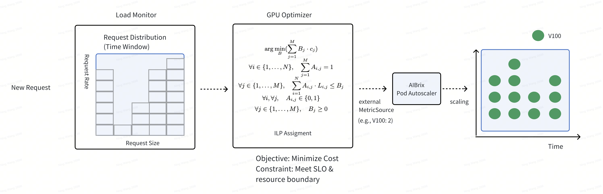

.. _optimizer-based-autoscaling:

==========================
Optimizer-based Autoscaler
==========================

Overview 
--------

Optimizer-based Autoscaler is a proactive autoscaling solution which uses offline profiles of GPU to calculate the number of GPUs needed for the deployment rather than using GPU usage metrics. It includes (1) LLM Request Monitoring and (2) GPU Optimizer. The following figure shows the overall architecture. First, the LLM Request Monitoring component is responsible for monitoring past inference requests and their request patterns. Second, the GPU Optimizer component is responsible for calculating the optimal GPU number recommendation based on the request patterns and sending the recommendation to the K8s KPA.

How It Works
------------------------------------------

Step 1: Offline GPU-Model Benchmark per Input-Output Pattern
^^^^^^^^^^^^^^^^^^^^^^^^^^^^^^^^^^^^^^^^^^^^^^^^^^^^^^^^^^^^

Benchmark model. For each type of GPU, run ``aibrix_benchmark``. See `benchmark.sh <https://github.com/aibrix/aibrix/tree/main/python/aibrix/aibrix/gpu_optimizer/optimizer/profiling/benchmark.sh>`_ for more options.

.. code-block:: bash

    kubectl port-forward [pod_name] 8010:8000 1>/dev/null 2>&1 &
    # Wait for port-forward taking effect.
    aibrix_benchmark -m deepseek-llm-7b-chat -o [path_to_benchmark_output]

Step 2: Decide SLO and GPU-Model Profile Generation, run `aibrix_gen_profile -h` for help.
  
.. code-block:: bash

    kubectl -n aibrix-system port-forward svc/aibrix-redis-master 6379:6379 1>/dev/null 2>&1 &
    # Wait for port-forward taking effect.
    aibrix_gen_profile deepseek-llm-7b-chat-v100 --cost [cost1] [SLO-metric] [SLO-value] -o "redis://localhost:6379/?model=deepseek-llm-7b-chat"

Now the GPU Optimizer is ready to work. You should observe that the number of workload pods changes in response to the requests sent to the gateway. Once the GPU optimizer finishes the scaling optimization, the output of the GPU optimizer is passed to PodAutoscaler as a metricSource via a designated HTTP endpoint for the final scaling decision.  The following is an example of PodAutoscaler spec.

The optimizer-based autoscaler decides the number of GPUs based on the offline GPU capacity profiling. It proactively calculates the overall capacity needed for serving requests under SLO and ensures that the GPU capacity is fully used but not overloaded. The GPU optimizer's output is exposed as custom metrics. The following shows how these custom metrics can be checked.

.. code-block:: bash

    kubectl port-forward svc/aibrix-gpu-optimizer 8080:8080

    curl http://localhost:8080/metrics/default/deepseek-llm-7b-chat-v100
    # HELP vllm:deployment_replicas Number of suggested replicas.
    # TYPE vllm:deployment_replicas gauge
    vllm:deployment_replicas{model_name="deepseek-llm-7b-chat"} 1

How to deploy autoscaling object
--------------------------------
It is simply a matter of applying the podautoscaler yaml file. The GPU optimizer exposes custom metrics which can be used by podautoscalers to make scaling decisions as explained above. One important thing you should note is that the deployment name and the name in scaleTargetRef in PodAutoscaler must be the same. That's how AIBrix PodAutoscaler refers to the right deployment.

All the sample files can be found in the following directory. 

.. code-block:: bash
    
    https://github.com/aibrix/aibrix/tree/main/samples/autoscaling

Example Optimizer-based KPA yaml config
^^^^^^^^^^^^^^^^^^^^^^^^^^^^^^^^^^^^^^^

.. literalinclude:: ../../../../samples/autoscaling/optimizer-kpa.yaml
   :language: yaml

Check autoscaling logs
----------------------

GPU optimizer Logs
^^^^^^^^^^^^^^^^^^^

Gpu optimizer is an individual component that plays the role of collecting metrics from each pod. You can check its logs in this way. ``kubectl logs <aibrix-gpu-optimizer-podname> -n aibrix-system -f``

.. code-block:: bash

    {"time": "2025-02-12 06:23:52,086", "level": "INFO", "logger": "aibrix.gpu_optimizer.load_monitor", "message": "deepseek-llm-7b-chat optimization took 6.660938262939453 ms, cost $51.3324, coverage: 72.62180974477958%: [deepseek-llm-7b-chat-v100: 2($51.3324)]"}

In the above logs, the GPU optimizer returns the number of GPUs suggested, which is 2 in this example. 

Preliminary experiments with different autoscalers
--------------------------------------------------

Here we show the preliminary experiment results to show how different autoscaling mechanisms and configurations for autoscalers affect performance(latency) and cost (compute cost). 

- Set up
    - Model: Deepseek 7B chatbot model
    - GPU type: V100
    - Max number of GPU: 8
    - HPA, KPA, and APA use metrics as the scaling metrics: 70.
    - Optimizer-based KPA SLO: E2E P99 100s
- Workload
    - The overall RPS trend starts with low RPS and goes up relatively fast until T=500 to evaluate how different autoscaler and config reacts to the rapid load increase. After that, it goes down to low RPS quickly to evaluate scaling down behavior and goes up again slowly.
        - Average RPS trend: 0.5 RPS -> 2 RPS -> 4 RPS -> 5 RPS -> 1 RPS -> 3 RPS

Experiments Results
^^^^^^^^^^^^^^^^^^^

- gpu_cache_usage_perc: 70

.. image:: ../../assets/images/autoscaler/optimizer-based-autoscaling-70-results.png
   :alt: result
   :width: 720px
   :align: center
