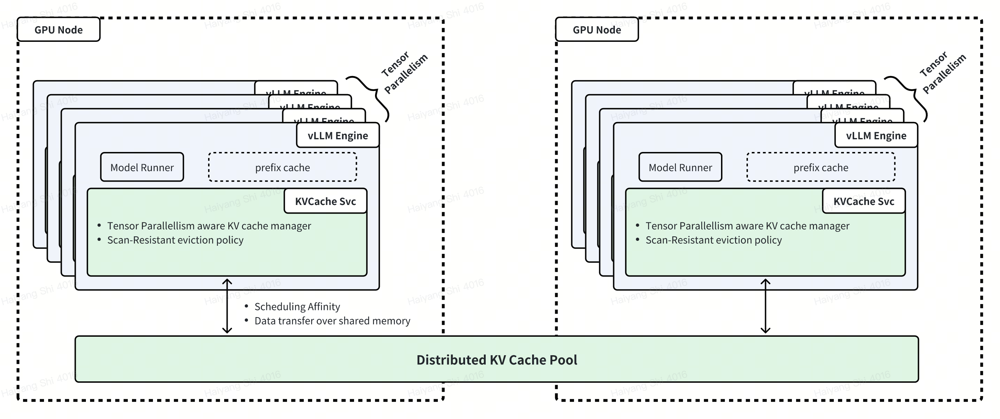
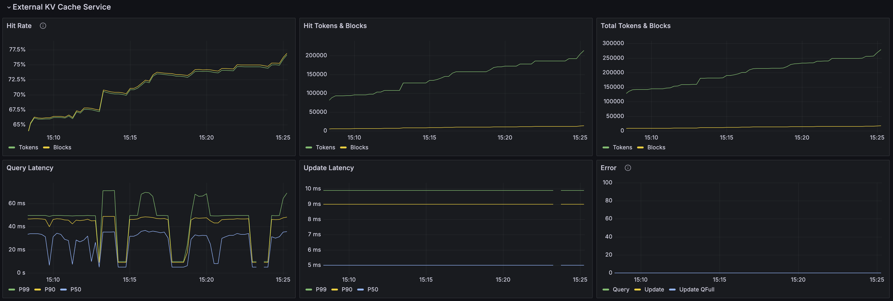

.. _distributed-kv-cache:

====================
Distributed KV Cache
====================

.. warning::
    Currently, distributed KV cache only supports FlashAttention.

The rising demand for large language models has intensified the need for efficient memory management and caching to optimize inference performance and reduce costs. In multi-round use cases like chatbots and agent-based systems, overlapping token sequences lead to redundant computations during the prefill phase, wasting resources and limiting throughput.

Many inference engines, such as `vLLM <https://github.com/vllm-project/vllm>`_, use built-in KV caching to mitigate this issue, leveraging idle HBM and DRAM. However, single-node KV caches face key limitations: constrained memory capacity, engine-specific storage that prevents sharing across instances, and difficulty supporting scenarios like KV migration and prefill-decode disaggregation.

AIBrix addresses these challenges with a distributed KV cache, enabling high-capacity, cross-engine KV reuse while optimizing network and memory efficiency. Our solution employs a scan-resistant eviction policy to persist hot KV tensors selectively, ensuring that network and memory usage is optimized by minimizing unnecessary data transfers, asynchronous metadata updates to reduce overhead, and cache-engine colocation for faster data transfer via shared memory.

Example
-------

.. note::
    We use a customized version of `vineyard <https://v6d.io/>`_ as the backend for distributed KV cache and an internal version of vLLM integrated with distributed KV cache support to showcase the usage. We are working with the vLLM community to upstream the distributed KV cache API and plugin.

After launching AIBrix's AI Runtime, we can use the following yaml to deploy a distributed KV cache cluster:

.. code-block:: yaml

    apiVersion: orchestration.aibrix.ai/v1alpha1
    kind: KVCache
    metadata:
      name: test-aibrix-model-deepseek-coder-33b-kvcache
      namespace: aibrix-system
      annotations:
        kvcache.orchestration.aibrix.ai/node-affinity-gpu-type: NVIDIA-L20
        kvcache.orchestration.aibrix.ai/pod-affinity-workload: test-aibrix-model-deepseek-coder-33b-instruct
    spec:
      replicas: 1
      service:
        type: ClusterIP
        port: 9600
      cacheSpec:
        image: aibrix-container-registry-cn-beijing.cr.volces.com/aibrix/vineyardd:20241120
        imagePullPolicy: IfNotPresent

.. note::
    ``kvcache.orchestration.aibrix.ai/pod-affinity-workload`` MUST match with ``metadata.name`` of the inference service deployment below

After deployment, we can see all the components by using ``kubectl get pods -n aibrix-system`` command:

.. code-block:: RST

    NAME                                                           READY   STATUS    RESTARTS   AGE
    test-aibrix-model-deepseek-coder-33b-kvcache-596965997-p86cx   1/1     Running   0          2m
    test-aibrix-model-deepseek-coder-33b-kvcache-etcd-0            1/1     Running   0          2m
    vineyard-controller-manager-74b47594f5-5xl8s                   2/2     Running   0          3m

After all components are running, we can use the following yaml to deploy the inference service:

.. code-block:: yaml
    :emphasize-lines: 39,40,41,42,43,44,45,46,47,48,49,50,51,52,53,54,55,56,57,58,59,60,93,94,95,96

    apiVersion: apps/v1
    kind: Deployment
    metadata:
      name: test-aibrix-model-deepseek-coder-33b-instruct
      labels:
        model.aibrix.ai/name: deepseek-coder-33b-instruct
        model.aibrix.ai/port: "8000"
    spec:
      strategy:
        rollingUpdate:
          maxSurge: 1
          maxUnavailable: 1
        type: RollingUpdate
      template:
        spec:
          containers:
            - name: vllm-openai
              image: aibrix-container-registry-cn-beijing.cr.volces.com/aibrix/vllm-openai:v0.6.1-edb07092-20250118
              imagePullPolicy: Always
              command:
              - python3
              - -m
              - vllm.entrypoints.openai.api_server
              - --port
              - "8000"
              - --model
              - /models/deepseek-coder-33b-instruct/
              - --served-model-name
              - test-deepseek-coder-33b-instruct
              - --distributed-executor-backend
              - ray
              - --trust-remote-code
              - --tensor-parallel-size
              - "4"
              - --max-model-len
              - "17000"
              - --enable-prefix-caching
              - --disable-fastapi-docs
              env:
              - name: VLLM_USE_VINEYARD_CACHE
                value: "1"
              - name: VINEYARD_CACHE_CPU_MEM_LIMIT_GB
                value: "70"
              - name: AIBRIX_LLM_KV_CACHE
                value: "1"
              - name: AIBRIX_LLM_KV_CACHE_KV_CACHE_NS
                value: "aibrix"
              - name: AIBRIX_LLM_KV_CACHE_CHUNK_SIZE
                value: "16"
              - name: AIBRIX_LLM_KV_CACHE_SOCKET
                value: /var/run/vineyard.sock
              - name: AIBRIX_LLM_KV_CACHE_RPC_ENDPOINT
                value: "test-aibrix-model-deepseek-coder-33b-kvcache-rpc.aibrix-system:9600"
              - name: VINEYARD_CACHE_ENABLE_ASYNC_UPDATE
                value: "1"
              - name: "VINEYARD_CACHE_METRICS_ENABLED"
                value: "1"
              volumeMounts:
                - mountPath: /var/run
                  name: kvcache-socket
          initContainers:
            - name: init-model
              image: aibrix-container-registry-cn-beijing.cr.volces.com/aibrix/runtime:v0.2.0-rc.2
              imagePullPolicy: Always
              command:
              - aibrix_download
              - --model-uri
              - tos://aibrix-artifact-testing/models/deepseek-coder-33b-instruct/
              - --local-dir
              - /models/
              env:
                - name: DOWNLOADER_NUM_THREADS
                  value: "16"
                - name: DOWNLOADER_ALLOW_FILE_SUFFIX
                  value: json, safetensors
                - name: TOS_ACCESS_KEY
                  valueFrom:
                    secretKeyRef:
                      name: tos-credential
                      key: TOS_ACCESS_KEY
                - name: TOS_SECRET_KEY
                  valueFrom:
                    secretKeyRef:
                      name: tos-credential
                      key: TOS_SECRET_KEY
                - name: TOS_ENDPOINT
                  value: tos-cn-beijing.ivolces.com
                - name: TOS_REGION
                  value: cn-beijing
              volumeMounts:
                - mountPath: /models
                  name: model-hostpath
          volumes:
            - name: kvcache-socket
              hostPath:
                path: /var/run/vineyard-kubernetes/aibrix-system/test-aibrix-model-deepseek-coder-33b-kvcache

.. note::
    * ``metadata.name`` MUST match with ``kvcache.orchestration.aibrix.ai/pod-affinity-workload`` in the kv cache deployment
    * We need to include the Unix domain socket used by the distributed KV cache as a volume to the inference service pod (i.e., ``kvcache-socket`` in the example above)

.. note::
    ``VINEYARD_CACHE_CPU_MEM_LIMIT_GB`` needs to choose a proper value based on the pod memory resource requirement. For instance, if the pod memory resource requirement is ``P`` GB and the estimated memory consumption of the inference engine is ``E`` GB, we can set ``VINEYARD_CACHE_CPU_MEM_LIMIT_GB`` to ``P / tensor-parallel-size - E``.

Now let's use ``kubectl get pods`` command to ensure the inference service is running:

.. code-block:: RST

    NAME                                                             READY   STATUS    RESTARTS   AGE
    download-model                                                   1/1     Running   0          12m
    test-aibrix-model-deepseek-coder-33b-instruct-6b885ffd8b-2kfjv   2/2     Running   0          4m

Once the inference service is running, let's set up port fowarding so that we can test the service from local:

* Run ``kubectl get svc -n envoy-gateway-system`` to get the name of the Envoy Gateway service
.. code-block:: RST

    NAME                                     TYPE           CLUSTER-IP       EXTERNAL-IP                                       PORT(S)                                   AGE
    envoy-aibrix-system-aibrix-eg-903790dc   LoadBalancer   172.19.190.6     10.0.1.4,2406:d440:105:cf01:6f1b:7f4d:12da:c5a5   80:30904/TCP                              3d

* Run ``kubectl -n envoy-gateway-system port-forward svc/envoy-aibrix-system-aibrix-eg-903790dc 8888:80 &`` to set up port forwarding
.. code-block:: RST

    Forwarding from 127.0.0.1:8888 -> 10080
    Forwarding from [::1]:8888 -> 10080

Now, let's test the service:

.. code-block:: shell

    curl -v "http://localhost:8888/v1/chat/completions" \
      -H "Content-Type: application/json" \
      -H "Authorization: XXXXXXXXXXXXXXXXXXXXXXXX" \
      -d '{
         "model": "test-deepseek-coder-33b-instruct",
         "messages": [{"role": "user", "content": "Created container vllm-openai"}],
         "temperature": 0.7
       }'

and its output would be:

.. code-block:: RST

    *   Trying [::1]:8888...
    * Connected to localhost (::1) port 8888
    > POST /v1/chat/completions HTTP/1.1
    > Host: localhost:8888
    > User-Agent: curl/8.4.0
    > Accept: */*
    > Content-Type: application/json
    Handling connection for 8888
    > Authorization: XXXXXXXXXXXXXXXXXXXXXXXX
    > Content-Length: 174
    >
    < HTTP/1.1 200 OK
    < date: Thu, 30 Jan 2025 23:50:08 GMT
    < server: uvicorn
    < content-type: application/json
    < x-went-into-resp-headers: true
    < transfer-encoding: chunked
    <
    * Connection #0 to host localhost left intact
    {
      "id": "chat-60f0247aa9294f8abb61e8f24c1503c2",
      "object": "chat.completion",
      "created": 1738281009,
      "model": "test-deepseek-coder-33b-instruct",
      "choices": [
        {
          "index": 0,
          "message": {
            "role": "assistant",
            "content": "It seems like you're trying to create a container with the name \"vllm-openai\". However, your question is missing some context. Could you please provide more details? Are you using Docker, Kubernetes, or another container orchestration tool? Or are you asking how to create a container for a specific application or service? The details will help me provide a more accurate answer.",
            "tool_calls": []
          },
          "logprobs": null,
          "finish_reason": "stop",
          "stop_reason": null
        }
      ],
      "usage": {
        "prompt_tokens": 76,
        "total_tokens": 161,
        "completion_tokens": 85
      },
      "prompt_logprobs": null
    }

Distribute KV cache metrics can be viewed in the AIBrix Engine Dashboard. The following is an example of the dashboard panels for the distributed KV cache:

