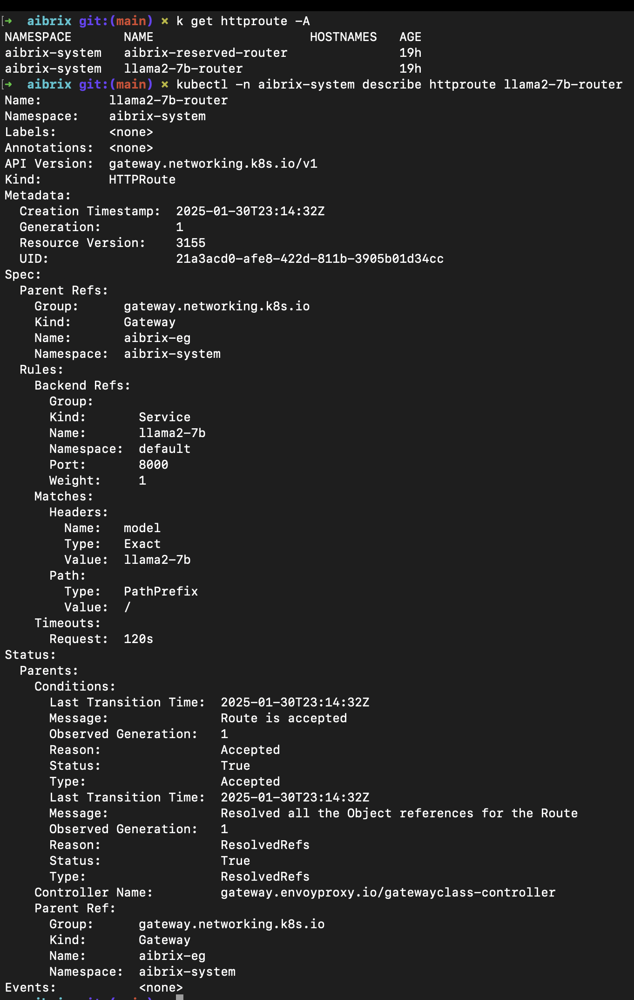

.. _gateway:

===============
Gateway Routing
===============

Gateway is developed as external processing service using envoy's gateway extension policy. Gateway is designed to serve LLM requests and provides features such as dynamic model & lora adapter discovery, user configuration for request count & token usage budgeting, streaming and advanced routing strategies such as prefix-cache aware, heterogeneous GPU hardware. 

.. figure:: ../assets/images/gateway-design.png
  :alt: gateway-design
  :width: 70%
  :align: center

Dynamic Routing
---------------

First, get the external ip and port for the envoy proxy to access gateway.

.. code-block:: bash

    kubectl -n envoy-gateway-system get service   
    NAME                                     TYPE           CLUSTER-IP       EXTERNAL-IP                                           PORT(S)                                   
    envoy-aibrix-system-aibrix-eg-903790dc   LoadBalancer   172.19.190.6     10.10.10.10,1000:1000:1000:1000:1000:1000:1000:1000   80:30904/TCP

On a model or lora adapter deployment, their respective controllers create a HTTPRoute object which gateway dynamically discovers to forward input user request. Make sure to verify that httproute status as Accepted. 

Sample request, get external ip:port from first step and model-name from deployments label "model.aibrix.ai/name".

.. code-block:: bash

    curl -v http://<ip>:<port>/v1/chat/completions \
    -H "Content-Type: application/json" \
    -H "Authorization: Bearer any_key" \
    -d '{
        "model": "your-model-name",
        "messages": [{"role": "user", "content": "Say this is a test!"}],
        "temperature": 0.7
    }'

Routing Strategies
------------------

Below are routing strategies gateway supports

* random: routes request to a random pod.
* least-request: routes request to a pod with least ongoing request.
* throughput: routes request to a pod which has processed lowest tokens.
* prefix-cache: routes request to a pod which already has KV cache for prompt.

.. code-block:: bash

    curl -v http://<ip>:<port>/v1/chat/completions \
    -H "routing-strategy: least-request" \
    -H "Content-Type: application/json" \
    -H "Authorization: Bearer any_key" \
    -d '{
        "model": "your-model-name",
        "messages": [{"role": "user", "content": "Say this is a test!"}],
        "temperature": 0.7
    }'

Rate Limiting
-------------

The gateway supports rate limiting based on the `user` header. You can specify a unique identifier for each `user` to apply rate limits such as requests per minute (RPM) or tokens per minute (TPM).
This `user` header is essential for enabling rate limit support for each client.

To set up rate limiting, add the user header in the request, like this:

.. code-block:: bash

    curl -v http://<ip>:<port>/v1/chat/completions \
    -H "user: your-user-id" \
    -H "Content-Type: application/json" \
    -H "Authorization: Bearer any_key" \
    -d '{
        "model": "your-model-name",
        "messages": [{"role": "user", "content": "Say this is a test!"}],
        "temperature": 0.7
    }'

.. note::
    Replace "your-user-id" with a unique identifier for each user. This identifier allows the gateway to enforce rate limits on a per-user basis.
    If rate limit support is required, ensure this `user` header is always set in the request. if you do not need rate limit, you do not need to set this header.

