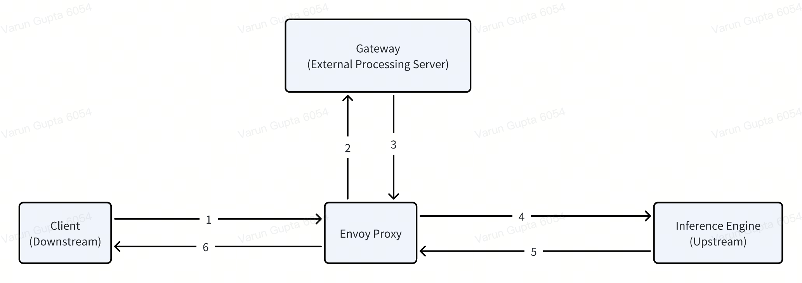

.. _gateway:

===============
Gateway Routing
===============

Gateway is developed as external processing service using envoy's gateway extension policy. Gateway is designed to serve LLM requests and provides features such as dynamic model & lora adapter discovery, user configuration for request count & token usage budgeting, streaming and advanced routing strategies such as prefix-cache aware, heterogeneous GPU hardware. 

Dynamic Routing
---------------

First, get the external ip and port for the envoy proxy to access gateway.

.. code-block:: bash

    NAME                                     TYPE           CLUSTER-IP      EXTERNAL-IP   PORT(S)                                   AGE
    envoy-aibrix-system-aibrix-eg-903790dc   LoadBalancer   10.96.239.246   101.18.0.4    80:32079/TCP                              10d
    envoy-gateway                            ClusterIP      10.96.166.226   <none>        18000/TCP,18001/TCP,18002/TCP,19001/TCP   10d

On a model or lora adapter deployment, their respective controllers create a HTTPRoute object which gateway dynamically discovers to forward input user request. Make sure to verify that httproute status as Accepted. 

.. code-block:: bash

    $ kubectl get httproute -A
    NAMESPACE       NAME                                  HOSTNAMES   AGE
    aibrix-system   aibrix-reserved-router                            17m # reserved router
    aibrix-system   deepseek-r1-distill-llama-8b-router               14m # created for each model deployment
    ....

.. code-block:: bash

    $ kubectl describe httproute deepseek-r1-distill-llama-8b-router -n aibrix-system
    Name:         deepseek-r1-distill-llama-8b-router
    Namespace:    aibrix-system
    Labels:       <none>
    Annotations:  <none>
    API Version:  gateway.networking.k8s.io/v1
    Kind:         HTTPRoute
    Metadata:
      Creation Timestamp:  2025-02-16T17:56:03Z
      Generation:          1
      Resource Version:    2641
      UID:                 2f3f9620-bf7c-487a-967e-2436c3809178
    Spec:
      Parent Refs:
        Group:      gateway.networking.k8s.io
        Kind:       Gateway
        Name:       aibrix-eg
        Namespace:  aibrix-system
      Rules:
        Backend Refs:
          Group:
          Kind:       Service
          Name:       deepseek-r1-distill-llama-8b
          Namespace:  default
          Port:       8000
          Weight:     1
        Matches:
          Headers:
            Name:   model
            Type:   Exact
            Value:  deepseek-r1-distill-llama-8b
          Path:
            Type:   PathPrefix
            Value:  /
        Timeouts:
          Request:  120s
    Status:
      Parents:
        Conditions:
          Last Transition Time:  2025-02-16T17:56:03Z
          Message:               Route is accepted
          Observed Generation:   1
          Reason:                Accepted
          Status:                True
          Type:                  Accepted
          Last Transition Time:  2025-02-16T17:56:03Z
          Message:               Resolved all the Object references for the Route
          Observed Generation:   1
          Reason:                ResolvedRefs
          Status:                True
          Type:                  ResolvedRefs
        Controller Name:         gateway.envoyproxy.io/gatewayclass-controller
        Parent Ref:
          Group:      gateway.networking.k8s.io
          Kind:       Gateway
          Name:       aibrix-eg
          Namespace:  aibrix-system
    Events:           <none>

In most Kubernetes setups, ``LoadBalancer`` is supported by default. You can retrieve the external IP using the following command:

.. code-block:: bash

    LB_IP=$(kubectl get svc/envoy-aibrix-system-aibrix-eg-903790dc -n envoy-gateway-system -o=jsonpath='{.status.loadBalancer.ingress[0].ip}')
    ENDPOINT="${LB_IP}:80"

The model name, such as ``deepseek-r1-distill-llama-8b``, must match the label ``model.aibrix.ai/name`` in your deployment.

.. code-block:: bash

    curl -v http://${ENDPOINT}/v1/chat/completions \
    -H "Content-Type: application/json" \
    -d '{
        "model": "deepseek-r1-distill-llama-8b",
        "messages": [{"role": "user", "content": "Say this is a test!"}],
        "temperature": 0.7
    }'

.. attention::

    AIBrix expose the public endpoint to the internet. Please enable authentication to secure your endpoint.
    If vLLM, you can pass in the argument ``--api-key`` or environment variable ``VLLM_API_KEY`` to enable the server to check for API key in the header.
    Check `vLLM OpenAI-Compatible Server <https://docs.vllm.ai/en/latest/getting_started/quickstart.html#openai-compatible-server>`_ for more details.

After you enable the authentication, you can query model with ``-H Authorization: bearer your_key`` in this way

.. code-block:: bash
  :emphasize-lines: 3

    curl -v http://${ENDPOINT}/v1/chat/completions \
    -H "Content-Type: application/json" \
    -H "Authorization: Bearer any_key" \
    -d '{
        "model": "deepseek-r1-distill-llama-8b",
        "messages": [{"role": "user", "content": "Say this is a test!"}],
        "temperature": 0.7
    }'

Routing Strategies
------------------

Below are routing strategies gateway supports:

* ``random``: routes request to a random pod.
* ``least-request``: routes request to a pod with the fewest ongoing requests.
* ``throughput``: routes request to a pod which has processed the lowest total weighted tokens.
* ``prefix-cache``: routes request to a pod which already has a KV cache matching the request's prompt prefix, includes load balancing and multiturn conversation.
* ``least-busy-time``: routes request to the pod with the least cumulative busy processing time.
* ``least-kv-cache``: routes request to the pod with the smallest current KV cache size (least VRAM used).
* ``least-latency``: routes request to the pod with the lowest average processing latency.
* ``prefix-cache-preble``: routes request considering both prefix cache hits and pod load, implementation is based of Preble: Efficient Distributed Prompt Scheduling for LLM Serving: https://arxiv.org/abs/2407.00023.
* ``vtc-basic``: routes request using a hybrid score balancing fairness (user token count) and pod utilization. It is a simple variant of Virtual Token Counter (VTC) algorithm.  See more details at https://github.com/Ying1123/VTC-artifact

.. code-block:: bash

    curl -v http://${ENDPOINT}/v1/chat/completions \
    -H "routing-strategy: least-request" \
    -H "Content-Type: application/json" \
    -d '{
        "model": "your-model-name",
        "messages": [{"role": "user", "content": "Say this is a test!"}],
        "temperature": 0.7
    }'

Rate Limiting
-------------

The gateway supports rate limiting based on the `user` header. You can specify a unique identifier for each `user` to apply rate limits such as requests per minute (RPM) or tokens per minute (TPM).
This `user` header is essential for enabling rate limit support for each client.

To set up rate limiting, add the user header in the request, like this:

.. code-block:: bash

    curl -v http://${ENDPOINT}/v1/chat/completions \
    -H "user: your-user-id" \
    -H "Content-Type: application/json" \
    -H "Authorization: Bearer any_key" \
    -d '{
        "model": "your-model-name",
        "messages": [{"role": "user", "content": "Say this is a test!"}],
        "temperature": 0.7
    }'

.. note::
    Replace "your-user-id" with a unique identifier for each user. This identifier allows the gateway to enforce rate limits on a per-user basis.
    If rate limit support is required, ensure this `user` header is always set in the request. if you do not need rate limit, you do not need to set this header.

Headers Explanation
--------------------

This sections describes various **custom headers** used in request processing for debugging and routing in the system.

Target Headers & General Error Headers
^^^^^^^^^^^^^^^^^^^^^^^^^^^^^^^^^^^^^^

.. list-table::
   :header-rows: 1
   :widths: 25 75

   * - Header Name
     - Description
   * - ``request-id``
     - Unique request-id associated with client request, helpful for debugging.   
   * - ``x-went-into-req-headers``
     - Indicates whether the request headers were processed correctly. Used for debugging header parsing issues.
   * - ``target-pod``
     - Specifies the destination pod selected by the routing algorithm. Useful for verifying routing decisions.
   * - ``routing-strategy``
     - Defines the routing strategy applied to this request. Ensures correct routing logic is followed.

Routing & Error Debugging Headers
^^^^^^^^^^^^^^^^^^^^^^^^^^^^^^^^^

.. list-table::
   :header-rows: 1
   :widths: 25 75

   * - Header Name
     - Description
   * - ``x-error-user``
     - Identifies errors related to incorrect user input. Useful for client-side debugging.
   * - ``x-error-routing``
     - Indicates an issue in routing logic, such as failed to select target pod.
   * - ``x-error-response-unmarshal``
     - Signals that the response body could not be parsed correctly, often due to an internal issue.
   * - ``x-error-response-unknown``
     - Generic error header when no specific issue is identified.
   * - ``x-error-request-body-processing``
     - Marks an issue with request body parsing, such as invalid JSON.
   * - ``x-error-no-model-in-request``
     - Specifies that no model option was given for the request. Useful for model parameter validation debugging.
   * - ``x-error-no-model-backends``
     - Indicates that the requested model exists but has no active backends(pods).
   * - ``x-error-invalid-routing-strategy``
     - User passes invalid routing strategy name that AIBrix doesn't support.

Streaming Headers
^^^^^^^^^^^^^^^^^

.. list-table::
   :header-rows: 1
   :widths: 25 75

   * - Header Name
     - Description
   * - ``x-error-streaming``
     - Signals an error during response streaming, helping to diagnose streaming-related failures.
   * - ``x-error-stream``
     - Incorrect stream value set in the request body.
   * - ``x-error-no-stream-options-include-usage``
     - Indicates whether usage statistics were included in the streaming response.

Rate Limiting Headers
^^^^^^^^^^^^^^^^^^^^^

.. list-table::
   :header-rows: 1
   :widths: 25 75

   * - Header Name
     - Description
   * - ``x-update-rpm``
     - Indicates that the RPM (requests per minute) count was updated successfully
   * - ``x-update-tpm``
     - Indicates that the TPM (tokens per minute) count was updated successfully
   * - ``x-error-rpm-exceeded``
     - Signals that the request exceeded the allowed RPM threshold.
   * - ``x-error-tpm-exceeded``
     - Signals that the request exceeded the allowed TPM threshold.
   * - ``x-error-incr-rpm``
     - Error encountered while increasing the RPM counter.
   * - ``x-error-incr-tpm``
     - Error encountered while increasing the TPM counter.

Debugging Guidelines
^^^^^^^^^^^^^^^^^^^^

By following these steps, you can efficiently debug request processing, routing, streaming, and rate-limiting behavior in the system.

1. **Identify error headers**

   - If an issue occurs, inspect ``x-error-user``, ``x-error-routing``, ``x-error-response-unmarshal``, and ``x-error-response-unknown`` to determine the root cause.
   - For request processing issues, check ``x-error-request-body-processing`` and ``x-error-no-model-in-request``.

2. **Verify routing and model assignment**

   - Ensure ``target-pod`` is correctly set to confirm the routing algorithm selected the right backend.
   - If ``x-error-no-model-in-request`` or ``x-error-no-model-backends`` appears, verify that the request includes a valid model and that the model has active backends.
   - If ``x-error-invalid-routing-strategy`` is present, confirm that the routing strategy used is supported by AIBrix.

3. **Diagnose streaming issues**

   - If encountering problems with streamed responses, check ``x-error-streaming`` for any reported errors.
   - Ensure that ``x-error-stream`` is set correctly for streaming.
   - If usage statistics are missing from the streaming response, verify ``x-error-no-stream-options-include-usage``.

4. **Investigate rate limiting issues**

   - If the request was blocked, inspect ``x-error-rpm-exceeded`` or ``x-error-tpm-exceeded`` to confirm whether it exceeded rate limits.
   - If rate limit updates failed, look for ``x-error-incr-rpm`` or ``x-error-incr-tpm``.
   - Successful rate limit updates will be indicated by ``x-update-rpm`` and ``x-update-tpm``.

Below are starting pointers to help debug.

1. Ensure that status.conditions == Accepted for below objects.

.. code-block:: bash

    kubectl describe gatewayclass -n aibrix-system
    
    kubectl describe gateway -n aibrix-system

    kubectl describe envoypatchpolicy -n aibrix-system

    # check for all objects
    kubectl describe envoyextensionpolicy -n aibrix-system 

    # check for all objects
    kubectl describe httproute -n aibrix-system  

2. Check the logs for envoy proxy and aibrix-gateway-plugins. Copy the logs, if a github issue is created.

.. code-block:: bash
    kubectl get pods -n envoy-gateway-system

    NAME                                                      READY   STATUS    RESTARTS   AGE
    envoy-aibrix-system-aibrix-eg-903790dc-84ccfcbc6b-hw2lq   2/2     Running   0          13m
    envoy-gateway-7c7659ffc9-rvm5s                            1/1     Running   0          16m

    kubectl logs envoy-aibrix-system-aibrix-eg-903790dc-84ccfcbc6b-hw2lq -n envoy-gateway-system

.. code-block:: bash
    kubectl get pods -n aibrix-system

    NAME                                        READY   STATUS             RESTARTS   AGE
    aibrix-controller-manager-fb4495448-j9k6g   1/1     Running            0          22m
    aibrix-gateway-plugins-6bd9fcd5b9-2bwpr     1/1     Running            0          22m
    aibrix-gpu-optimizer-df9db96c8-2fctd        1/1     Running            0          22m
    aibrix-kuberay-operator-5bf4985d86-7g4tz    1/1     Running            0          22m
    aibrix-metadata-service-9d4cd7f77-mq7tr     1/1     Running            0          22m
    aibrix-redis-master-7d6b77c794-bcqxc        1/1     Running            0          22m

    kubectl logs aibrix-gateway-plugins-6bd9fcd5b9-2bwpr -n aibrix-system
