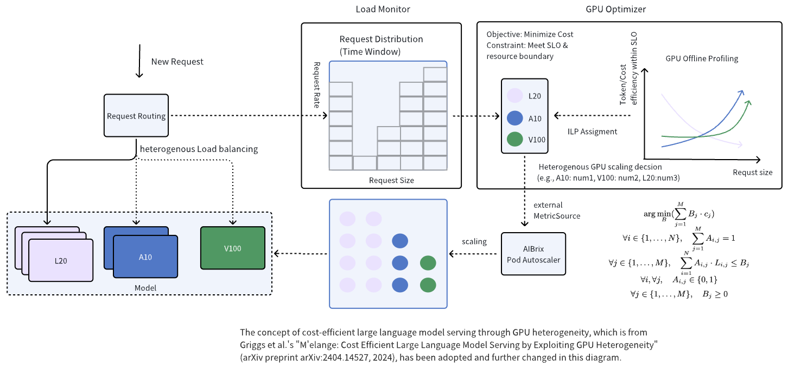

.. _heterogeneous-gpu:

==============================================
Heterogeneous GPU Inference (Experimental)
==============================================

Heterogeneous GPU Inference is a feature that enables users to utilize different types of GPUs for deploying the same model. This feature addresses two primary challenges associated with Large Language Model (LLM) inference: (1) As the demand for large-scale model inference increases, ensuring consistent GPU availability has become a challenge, particularly within regions where identical GPU types are often unavailable due to capacity constraints. (2) Users may seek to incorporate lower-cost, lower-performance GPUs to reduce overall expenses. 

Design Overview
---------------

There are three main components in Heterogeneous GPU Inference Feature: (1) LLM Request Monitoring, (2) Heterogeneous GPU Optimizer, (3) Request Routing. The following figure shows the overall architecture. First, LLM Request Monitoring component is responsible for monitoring the past inference requests and their request patterns. Second, Heterogeneous GPU Optimizer component is responsible for selecting the optimal GPU type and the corresponding GPU count. Third, Request Routing component is responsible for routing the request to the optimal GPU.

Example
-------

**Preparation: Enable related components, including request tracking at the gateway.**

.. code-block:: bash

    # delete related components with experimental features disabled by default.
    kubectl delete -k config/experimentals/gpu-optimizer
    # redeploy related components with experimental features enabled.
    kubectl apply -k config/experimentals/gpu-optimizer

Alternatively, you can enable the feature by editing the gateway plugin deployment using ``kubectl edit deployment aibrix-gateway-plugins -n aibrix-system`` and append env.

.. code-block:: yaml

    # spec:
    #   template:
    #     spec:
    #       containers:
    #         - name: gateway-plugin
    #           env:
                - name: AIBRIX_GPU_OPTIMIZER_TRACING_FLAG
                  value: "true"

**Step 1: Deploy the heterogeneous deployments.**

One deployment and corresponding PodAutoscaler should be deployed for each GPU type.
See `sample heterogeneous configuration <https://github.com/vllm-project/aibrix/tree/main/samples/heterogeneous>`_ for an example of heterogeneous configuration composed of two GPU types. The following codes
deploy heterogeneous deployments using L20 and V100 GPU.

.. code-block:: bash

    kubectl apply -f samples/heterogeneous

After deployment, you will see a inference service with two pods running on simulated L20 and A10 GPUs:

.. code-block:: bash

    kubectl get svc
    NAME                TYPE        CLUSTER-IP      EXTERNAL-IP   PORT(S)          AGE
    deepseek-coder-7b   NodePort    10.102.95.136   <none>        8000:30081/TCP   2s
    kubernetes          ClusterIP   10.96.0.1       <none>        443/TCP          54d

Incoming requests are routed through the gateway and directed to the optimal pod based on request patterns:

.. code-block:: bash

    kubectl get pods
    NAME                                       READY   STATUS    RESTARTS   AGE
    deepseek-coder-7b-v100-96667667c-6gjql     2/2     Running   0          33s
    deepseek-coder-7b-l20-96667667c-7zj7k      2/2     Running   0          33s

**Step 2: Install aibrix python module.**

.. code-block:: bash

    pip3 install aibrix

The GPU Optimizer runs continuously in the background, dynamically adjusting GPU allocation for each model based on workload patterns. Note that GPU optimizer requires offline inference performance benchmark data for each type of GPU on each specific LLM model.

  
If local heterogeneous deployments is used, you can find the prepared benchmark data under `python/aibrix/aibrix/gpu_optimizer/optimizer/profiling/result/ <https://github.com/vllm-project/aibrix/tree/main/python/aibrix/aibrix/gpu_optimizer/optimizer/profiling/result/>`_ and skip Step 3. See :ref:`Development` for details on deploying a local heterogeneous deployments.

**Step 3: Benchmark model.**

For each type of GPU, run ``aibrix_benchmark``. See `benchmark.sh <https://github.com/vllm-project/aibrix/tree/main/python/aibrix/aibrix/gpu_optimizer/optimizer/profiling/benchmark.sh>`_ for more options.

.. code-block:: bash

    kubectl port-forward [pod_name] 8010:8000 1>/dev/null 2>&1 &
    # Wait for port-forward taking effect.
    aibrix_benchmark -m deepseek-coder-7b -o [path_to_benchmark_output]

**Step 4: Decide SLO and generate profile.**

Run ``aibrix_gen_profile -h`` for help.
  
.. code-block:: bash

    kubectl -n aibrix-system port-forward svc/aibrix-redis-master 6379:6379 1>/dev/null 2>&1 &
    # Wait for port-forward taking effect.
    aibrix_gen_profile deepseek-coder-7b-v100 --cost [cost1] [SLO-metric] [SLO-value] -o "redis://localhost:6379/?model=deepseek-coder-7b"
    aibrix_gen_profile deepseek-coder-7b-l20 --cost [cost2] [SLO-metric] [SLO-value] -o "redis://localhost:6379/?model=deepseek-coder-7b"

Now the GPU Optimizer is ready to work. You should observe that the number of workload pods changes in response to the requests sent to the gateway. Once the GPU optimizer finishes the scaling optimization, the output of the GPU optimizer is passed to PodAutoscaler as a metricSource via a designated HTTP endpoint for the final scaling decision.  The following is an example of PodAutoscaler spec.

A simple example of PodAutoscaler spec for v100 GPU is as follows:

.. literalinclude:: ../../../samples/heterogeneous/deepseek-coder-7b-v100-podautoscaler.yaml
   :language: yaml

Miscellaneous
-------------

A new label label ``model.aibrix.ai/min_replicas`` is added to specifies the minimum number of replicas to maintain when there is no workload. We recommend setting this to 1 for at least one Deployment spec to ensure there is always one READY pod available. For example, while the GPU optimizer might recommend 0 replicas for an v100 GPU during periods of no activity, setting ``model.aibrix.ai/min_replicas: "1"`` will maintain one v100 replica. This label only affects the system when there is no workload - it is ignored when there are active requests.

.. code-block:: yaml

    apiVersion: apps/v1
    kind: Deployment
    metadata:
      name: deepseek-coder-7b-v100
      labels:
        model.aibrix.ai/name: "deepseek-coder-7b"
        model.aibrix.ai/min_replicas: "1" # min replica for gpu optimizer when no workloads.
    ... rest yaml deployments

Important: The ``minReplicas`` field in the PodAutoscaler spec must be set to 0 to allow proper scaling behavior. Setting it to any value greater than 0 will interfere with the GPU optimizer's scaling decisions. For instance, if the GPU optimizer determines an optimal configuration of ``{v100: 0, l20: 4}`` but the v100 PodAutoscaler has ``minReplicas: 1``, the system won't be able to scale the v100 down to 0 as recommended.

