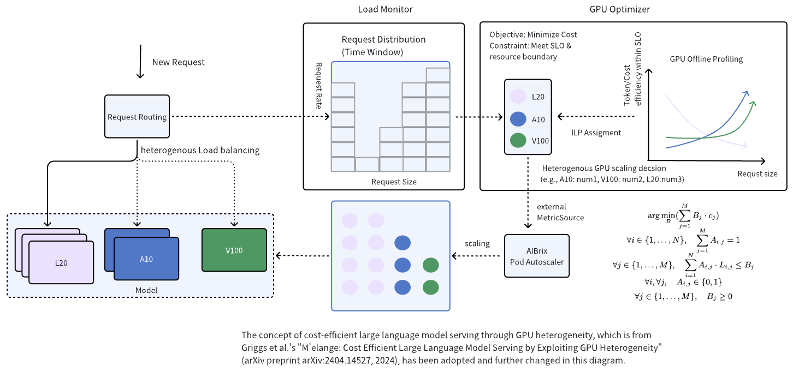

.. _heterogeneous-gpu:

==========================================
Heterogeneous GPU Inference (Experimental)
==========================================

Heterogeneous GPU Inference is a feature that enables users to utilize different types of GPUs for deploying the same model. This feature addresses two primary challenges associated with Large Language Model (LLM) inference: (1) As the demand for large-scale model inference increases, ensuring consistent GPU availability has become a challenge, particularly within regions where identical GPU types are often unavailable due to capacity constraints. (2) Users may seek to incorporate lower-cost, lower-performance GPUs to reduce overall expenses. 

Design Overview
---------------

There are three main components in Heterogeneous GPU Inference Feature: (1) LLM Request Monitoring, (2) Heterogeneous GPU Optimizer, (3) Request Routing. The following figure shows the overall architecture. First, LLM Request Monitoring component is responsible for monitoring the past inference requests and their request patterns. Second, Heterogeneous GPU Optimizer component is responsible for selecting the optimal GPU type and the corresponding GPU count. Third, Request Routing component is responsible for routing the request to the optimal GPU.

This feature is the heterogeneous form of :doc:`autoscaling/optimizer-based-autoscaling`:
the same GPU optimizer, fed one benchmark profile per GPU type, decides how many replicas of
each type to run. Read that page first for the request-tracing and profiling workflow; this
page covers what is specific to mixing GPU types.

Prerequisites
-------------

* One ``Deployment`` per GPU type, all carrying the same ``model.aibrix.ai/name`` label and
  each pinned to its GPU type through node selectors or affinity. The gateway treats them as
  one model.
* One ``PodAutoscaler`` per deployment, each reading the optimizer's metric for its own
  deployment.
* Request tracing enabled on the gateway plugin and the ``aibrix`` Python package installed
  locally for benchmarking, as described in :doc:`autoscaling/optimizer-based-autoscaling`.
* For SLO-aware routing across the GPU types, profiling data for each workload on each GPU
  type (see `Routing Support`_).

Example
-------

**Preparation: Enable related components, including request tracking at the gateway.**

.. code-block:: bash

    # delete related components with experimental features disabled by default.
    kubectl delete -k config/experimentals/gpu-optimizer
    # redeploy related components with experimental features enabled.
    kubectl apply -k config/experimentals/gpu-optimizer

Alternatively, you can enable the feature by editing the gateway plugin deployment using ``kubectl edit deployment aibrix-gateway-plugins -n aibrix-system`` and append env.

.. code-block:: yaml

    # spec:
    #   template:
    #     spec:
    #       containers:
    #         - name: gateway-plugin
    #           env:
                - name: AIBRIX_GPU_OPTIMIZER_TRACING_FLAG
                  value: "true"

**Step 1: Deploy the heterogeneous deployments.**

One deployment and corresponding PodAutoscaler should be deployed for each GPU type.
See `sample heterogeneous configuration <https://github.com/vllm-project/aibrix/tree/main/samples/heterogeneous>`_ for an example of heterogeneous configuration composed of two GPU types. The following command
deploys heterogeneous deployments using L20 and V100 GPUs.

.. code-block:: bash

    kubectl apply -k samples/heterogeneous

The sample is a kustomization that creates one Service and two deployments,
``deepseek-coder-7b-l20`` (4 replicas) and ``deepseek-coder-7b-v100`` (0 replicas), each pinned
to its GPU type through node affinity on the ``machine.cluster.vke.volcengine.com/gpu-name``
label. Adjust the affinity and replica counts to your cluster. The output below comes from a
test environment with one pod per GPU type:

.. code-block:: bash

    kubectl get svc
    NAME                TYPE        CLUSTER-IP      EXTERNAL-IP   PORT(S)          AGE
    deepseek-coder-7b   NodePort    10.102.95.136   <none>        8000:30081/TCP   2s
    kubernetes          ClusterIP   10.96.0.1       <none>        443/TCP          54d

Incoming requests are routed through the gateway and directed to the optimal pod based on request patterns:

.. code-block:: bash

    kubectl get pods
    NAME                                       READY   STATUS    RESTARTS   AGE
    deepseek-coder-7b-v100-96667667c-6gjql     2/2     Running   0          33s
    deepseek-coder-7b-l20-96667667c-7zj7k      2/2     Running   0          33s

**Step 2: Install aibrix python module.**

.. code-block:: bash

    pip3 install aibrix

The GPU Optimizer runs continuously in the background, dynamically adjusting GPU allocation for each model based on workload patterns. Note that GPU optimizer requires offline inference performance benchmark data for each type of GPU on each specific LLM model.

  
If local heterogeneous deployments is used, you can find the prepared benchmark data under `python/aibrix/aibrix/gpu_optimizer/optimizer/profiling/result/ <https://github.com/vllm-project/aibrix/tree/main/python/aibrix/aibrix/gpu_optimizer/optimizer/profiling/result/>`_ and skip Step 3. See :ref:`Development` for details on deploying a local heterogeneous deployments.

**Step 3: Benchmark model.**

For each type of GPU, run ``aibrix_benchmark``. See `benchmark.sh <https://github.com/vllm-project/aibrix/tree/main/python/aibrix/aibrix/gpu_optimizer/optimizer/profiling/benchmark.sh>`_ for more options.

.. code-block:: bash

    kubectl port-forward [pod_name] 8010:8000 1>/dev/null 2>&1 &
    # Wait for port-forward taking effect.
    aibrix_benchmark -m deepseek-coder-7b -o [path_to_benchmark_output]

**Step 4: Decide SLO and generate profile.**

Run ``aibrix_gen_profile -h`` for help.
  
.. code-block:: bash

    kubectl -n aibrix-system port-forward svc/aibrix-redis-master 6379:6379 1>/dev/null 2>&1 &
    # Wait for port-forward taking effect.
    aibrix_gen_profile deepseek-coder-7b-v100 --cost [cost1] [SLO-metric] [SLO-value] -o "redis://localhost:6379/?model=deepseek-coder-7b"
    aibrix_gen_profile deepseek-coder-7b-l20 --cost [cost2] [SLO-metric] [SLO-value] -o "redis://localhost:6379/?model=deepseek-coder-7b"

Now the GPU Optimizer is ready to work. You should observe that the number of workload pods changes in response to the requests sent to the gateway. Once the GPU optimizer finishes the scaling optimization, the output of the GPU optimizer is passed to PodAutoscaler as a metricSource via a designated HTTP endpoint for the final scaling decision.  The following is an example of PodAutoscaler spec.

A simple example of PodAutoscaler spec for v100 GPU is as follows:

.. literalinclude:: ../../../samples/heterogeneous/deepseek-coder-7b-v100-podautoscaler.yaml
   :language: yaml

Miscellaneous
-------------

A new label label ``model.aibrix.ai/min_replicas`` is added to specifies the minimum number of replicas to maintain when there is no workload. We recommend setting this to 1 for at least one Deployment spec to ensure there is always one READY pod available. For example, while the GPU optimizer might recommend 0 replicas for an v100 GPU during periods of no activity, setting ``model.aibrix.ai/min_replicas: "1"`` will maintain one v100 replica. This label only affects the system when there is no workload - it is ignored when there are active requests.

.. code-block:: yaml

    apiVersion: apps/v1
    kind: Deployment
    metadata:
      name: deepseek-coder-7b-v100
      labels:
        model.aibrix.ai/name: "deepseek-coder-7b"
        model.aibrix.ai/min_replicas: "1" # min replica for gpu optimizer when no workloads.
    ... rest yaml deployments

Important: The ``minReplicas`` field in the PodAutoscaler spec must be set to 0 to allow proper scaling behavior. Setting it to any value greater than 0 will interfere with the GPU optimizer's scaling decisions. For instance, if the GPU optimizer determines an optimal configuration of ``{v100: 0, l20: 4}`` but the v100 PodAutoscaler has ``minReplicas: 1``, the system won't be able to scale the v100 down to 0 as recommended.

Configuration reference
-----------------------

.. list-table::
   :header-rows: 1
   :widths: 40 60

   * - Setting
     - Meaning
   * - ``AIBRIX_GPU_OPTIMIZER_TRACING_FLAG`` (gateway plugin env, default ``false``)
     - Records per-request token statistics for the optimizer. Required.
   * - ``model.aibrix.ai/name`` (label on every deployment)
     - The shared model name. Must match the ``model`` used when profiles were stored.
   * - ``model.aibrix.ai/min_replicas`` (label on a deployment)
     - Replicas to keep for that GPU type when there is no traffic. Set it to ``"1"`` on at
       least one deployment so the model always has a ready pod.
   * - ``spec.minReplicas: 0`` (on each PodAutoscaler)
     - Required. Any higher value prevents the optimizer from scaling that GPU type to zero.
   * - ``aibrix_gen_profile ... --cost <n>``
     - Relative cost of the GPU type. The optimizer minimises total cost, so give each GPU
       type its own value.
   * - ``routing-strategy: slo`` (request header)
     - Turn on SLO-aware routing for the request. Variants: ``slo-pack-load``,
       ``slo-least-load``, ``slo-least-load-pulling`` (the default for ``slo``).

Routing Support
---------------

During the performance evaluation, we observed that the existing routing policy does not adequately account for the varying serving capacities of heterogeneous GPUs. Specifically, the subsequent plot illustrates that the current routing strategy fails to adhere to the specified Service Level Objective (SLO).

.. figure:: ../assets/images/slo_routing/motivation.png
  :alt: SLO Routing Motivation Plot
  :width: 70%
  :align: center

The experimental configuration is as follows:

- SLO: P99 latency per token ≤ 0.05 seconds.
- Workloads: A mixed workload comprising `ShareGPT <https://huggingface.co/datasets/anon8231489123/ShareGPT_Vicuna_unfiltered>`_ (7 RPS) and CodeGeneration tasks (4 RPS), characterized by long prompts (over 4K tokens) and short responses (32-64 tokens).
- GPUs: A heterogeneous GPU environment consisting of NVIDIA A10 and NVIDIA L20 GPUs.

Our experiments indicate that an ideal routing scenario (Oracle) would assign ShareGPT workloads exclusively to A10 GPUs and CodeGeneration workloads exclusively to L20 GPUs. However, the existing routing policy (woRouting) randomly distributes requests between A10 and L20 GPUs, failing to replicate this ideal scenario. For comparative purposes, we also evaluated a scenario where all requests are handled solely by the more capable L20 GPUs (Scalar). Results demonstrated that although GPU optimizers can identify an optimal GPU configuration (Oracle Cost), the current routing policy results in significant performance degradation, queue accumulation at the gateway, unstable GPU configurations, and consistent violations of the SLO.

SLO routing policy was introduced in version v0.4.0 to address performance issues in heterogeneous GPU deployments. Requests must explicitly specify the ``routing-strategy: slo`` header to enable the SLO routing policy. Additionally, profiling data for each workload on each GPU is required to activate this policy effectively.

An example request applying the SLO routing policy is shown below:

.. code-block:: bash

    curl -v http://localhost:8888/v1/chat/completions \
		-H "model: llama2-7b" \
		-H "Content-Type: application/json" \
		-H "Authorization: Bearer [api_key]" \
		-H "routing-strategy: slo" \
		-d '{ \
			"model": "llama2-7b", \
			"messages": [{"role": "user", "content": "Say this is a test!"}], \
			"temperature": 0.7 \
		}'

In the same experimental settings, the SLO routing policy demonstrated its capability to achieve the targeted performance objectives.

.. figure:: ../assets/images/slo_routing/evaluation.png
  :alt: SLO Routing Motivation Plot
  :width: 70%
  :align: center

The SLO routing policy currently supports three variations: ``slo-pack-load``, ``slo-least-load``, and ``slo-least-load-pulling``(default policy when ``slo`` is specified). Each variation routes requests to GPUs likely to meet their respective SLOs but differ in handling requests among GPUs of the same type:

- ``slo-pack-load``: Prefers consolidating requests onto a single GPU if profiling suggests no SLO violation.
- ``slo-least-load``: Prefers routing requests to the least-loaded GPU of the same type, ignoring SLO violation predictions from profiling.
- ``slo-least-load-pulling``: Prefers routing requests to the least-loaded GPU of the same type. Requests predicted to violate the SLO are queued at the gateway and rejected if the SLO has already been breached.

The following figure compares the performance of the ``slo/slo-least-load-pulling`` and ``slo-pack-load`` variations. ``least-request`` policy is used as the baseline for a fair comparison.

.. figure:: ../assets/images/slo_routing/variation_comparison.png
  :alt: SLO Routing Motivation Plot
  :width: 70%
  :align: center