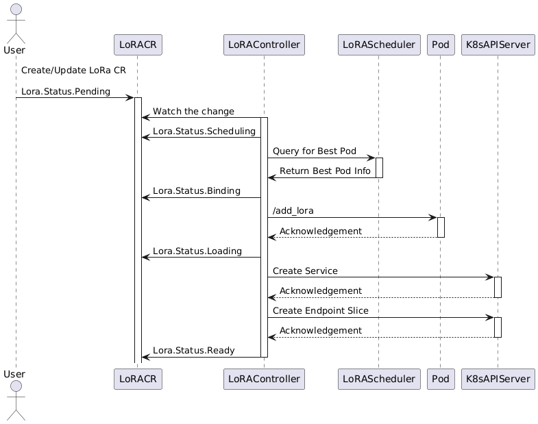

.. _lora:

====================
Lora Dynamic Loading
====================

The LoRA Model Adapter support is crucial for improving model density and reducing inference costs in large language models (LLMs).
By enabling dynamic loading and unloading of LoRA adapters, it allows multiple models to be deployed more efficiently on a shared infrastructure.
This reduces resource consumption by reusing base models across different tasks while swapping in lightweight LoRA adapters for specific model tuning.
The approach optimizes GPU memory usage, decreases cold start times, and enhances scalability,making it ideal for high-density deployment and cost-effective inference in production environments.

High Level Design
----------------------

We develop a ModelAdapter Controller to accept a lora CR and register/unregister to any match pods.

Model Adapter Service Discovery
^^^^^^^^^^^^^^^^^^^^^^^^^^^^^^^

We aim to reuse the `Kubernetes Service <https://kubernetes.io/docs/concepts/services-networking/service/>`_ as the abstraction layer for each lora model.
Traditionally, a single pod belongs to one service. However, for LoRA scenarios, we have multiple lora adapters in one pod.
In order to support such cases, we plan to customize the endpoint controller to allow a single pod with different LoRAs belong to multiple services.
To achieve this, the controller needs to watch LoRA changes and update the service endpoints accordingly. The overall concept is outlined below.
`Inf2 web page <https://aws.amazon.com/ec2/instance-types/inf2/>`_

vLLM Inference Changes
----------------------

High density Lora support can not be done solely in the control plane side, we also write an RFC about improving the
**Visibility of LoRA metadata**, **Dynamic Loading and Unloading**, **Remote Registry Support**, **Observability**
to enhance LoRA management for production grade serving. Please check `[RFC]: Enhancing LoRA Management for Production Environments in vLLM <https://github.com/vllm-project/vllm/issues/6275>`_ for more details.

Model Adapter Controller Sequence
^^^^^^^^^^^^^^^^^^^^^^^^^^^^^^^^^

Examples
--------
Here's one model adapter example.

.. code-block:: yaml

    apiVersion: model.aibrix.ai/v1alpha1
    kind: ModelAdapter
    metadata:
      name: llama-2-7b-sql-lora-test
      namespace: aibrix-system
      labels:
        model.aibrix.ai/name: "llama-2-7b-sql-lora-test"
        model.aibrix.ai/port: "8000"
    spec:
      baseModel: llama2-70b
      podSelector:
        matchLabels:
          model.aibrix.ai/name: llama2-70b
      artifactURL:  huggingface://yard1/llama-2-7b-sql-lora-test
      schedulerName: default

1. Kubernetes service has exact same name as ModelAdapter name.

2. The podSelector should match labels from the pods that are running the base model. This ensures that the LoRA adapter is correctly associated with the right pods.

.. attention::

    Best practice: use your model deployment's specific labels (like `model.aibrix.ai`) so that the adapter targets the correct set of pods that serve the base model.
    In this case, we are matching pods labeled `model.aibrix.ai=llama2-70b`.
