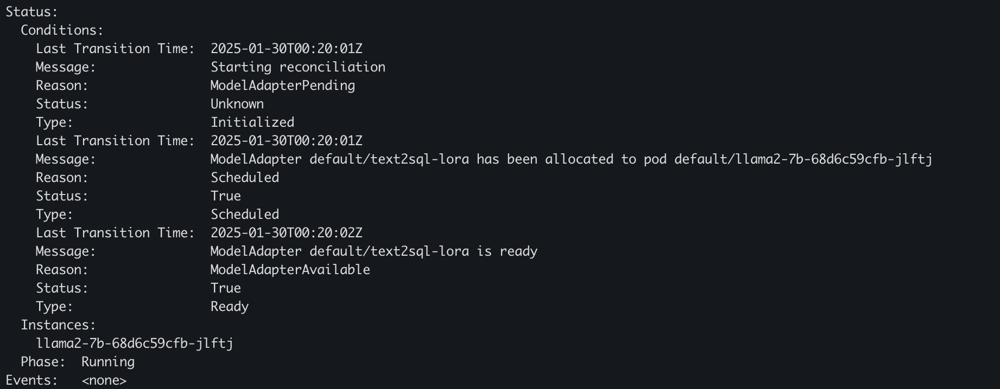

.. _lora:

====================
Lora Dynamic Loading
====================

The LoRA Model Adapter support is crucial for improving model density and reducing inference costs in large language models (LLMs).
By enabling dynamic loading and unloading of LoRA adapters, it allows multiple models to be deployed more efficiently on a shared infrastructure.

This reduces resource consumption by reusing base models across different tasks while swapping in lightweight LoRA adapters for specific model tuning.
The approach optimizes GPU memory usage, decreases cold start times, and enhances scalability, making it ideal for high-density deployment and cost-effective inference in production environments.

High Level Design
-----------------

Model Adapter Controller
^^^^^^^^^^^^^^^^^^^^^^^^

We develop a ModelAdapter `controller <https://kubernetes.io/docs/concepts/architecture/controller/>`_ to manage the lora model adapter lifecycle.
User can submit a lora `Custom Resource <https://kubernetes.io/docs/concepts/extend-kubernetes/api-extension/custom-resources/>`_ and controller will register to the matching pods, configure the service discovery and expose the adapter status.

.. figure:: ../assets/images/lora-controller-workflow.png
  :alt: lora-controller-workflow
  :width: 70%
  :align: center

Model Adapter Service Discovery
^^^^^^^^^^^^^^^^^^^^^^^^^^^^^^^

We aim to reuse the `Kubernetes Service <https://kubernetes.io/docs/concepts/services-networking/service/>`_ as the abstraction layer for each lora model.
Traditionally, a single pod belongs to one service. However, for LoRA scenarios, we have multiple lora adapters in one pod which breaks kubernete native design.
To support lora cases in kubernetes native way, we customize the lora endpoints and allow a single pod with different LoRAs belong to multiple services.

vLLM Engine Changes
^^^^^^^^^^^^^^^^^^^

High density Lora support can not be done solely in the control plane side, we also write an RFC about improving the
**Visibility of LoRA metadata**, **Dynamic Loading and Unloading**, **Remote Registry Support**, **Observability**
to enhance LoRA management for production grade serving. Please check `[RFC]: Enhancing LoRA Management for Production Environments in vLLM <https://github.com/vllm-project/vllm/issues/6275>`_ for more details.
Majority of the changes are done in vLLM, we just need to use the latest vLLM image and that would be ready for production.


Examples
--------

Here's one example of how to create a lora adapter.

Prerequisites
^^^^^^^^^^^^^

1. You have a base model deployed in the same namespace. 
2. vLLM engine needs to enable `VLLM_ALLOW_RUNTIME_LORA_UPDATING <VLLM_ALLOW_RUNTIME_LORA_UPDATING>`_ feature flag.
3. You have a lora model hosted on Huggingface or S3 compatible storage.


Create base model
^^^^^^^^^^^^^^^^^

.. code-block:: yaml

    apiVersion: apps/v1
    kind: Deployment
    metadata:
      name: llama2-7b
      namespace: default
      labels:
        model.aibrix.ai/name: "llama2-7b"
        model.aibrix.ai/port: "8000"
        adapter.model.aibrix.ai/enabled: "true"
    spec:
      replicas: 3
      selector:
        matchLabels:
          adapter.model.aibrix.ai/enabled: "true"
          model.aibrix.ai/name: "llama2-7b"
      template:
        metadata:
          labels:
            adapter.model.aibrix.ai/enabled: "true"
            model.aibrix.ai/name: "llama2-7b"
        spec:
          serviceAccountName: mocked-app-sa
          containers:
            - name: llm-engine
              # TODO: update
              image: aibrix/vllm-mock:nightly
              ports:
                - containerPort: 8000
            - name: aibrix-runtime
              image: aibrix/runtime:nightly
              command:
                - aibrix_runtime
                - --port
                - "8080"
              env:
                - name: INFERENCE_ENGINE
                  value: vllm
                - name: INFERENCE_ENGINE_ENDPOINT
                  value: http://localhost:8000
              ports:
                - containerPort: 8080
                  protocol: TCP
              livenessProbe:
                httpGet:
                  path: /healthz
                  port: 8080
                initialDelaySeconds: 3
                periodSeconds: 2
              readinessProbe:
                httpGet:
                  path: /ready
                  port: 8080
                initialDelaySeconds: 5
                periodSeconds: 10


Create lora model adapter
^^^^^^^^^^^^^^^^^^^^^^^^^

.. code-block:: yaml

    apiVersion: model.aibrix.ai/v1alpha1
    kind: ModelAdapter
    metadata:
      name: llama-2-7b-sql-lora
      namespace: default
      labels:
        model.aibrix.ai/name: "llama-2-7b-sql-lora"
        model.aibrix.ai/port: "8000"
    spec:
      baseModel: llama2-7b
      podSelector:
        matchLabels:
          model.aibrix.ai/name: llama2-7b
      artifactURL:  huggingface://yard1/llama-2-7b-sql-lora-test
      schedulerName: default

If you run ```kubectl describe modeladapter llama-2-7b-sql-lora``, you will see the status of the lora adapter.



Here's the resources created associated with the lora custom resource.

.. figure:: ../assets/images/lora-service-discovery-resources.png
  :alt: lora-service-discovery-resources
  :width: 70%
  :align: center


1. A new Kubernetes service will be created with the exact same name as ModelAdapter name.

2. The ``podSelector`` is used to filter the matching pods. In this case, it will match pods with label ``model.aibrix.ai/name=llama2-7b``. Make sure your base model have this label.
This ensures that the LoRA adapter is correctly associated with the right pods.

.. attention::

    Note: this is only working with vLLM engine. If you use other engine, feel free to open an issue.


More configurations
-------------------

Model Registry
^^^^^^^^^^^^^^

Currently, we support Huggingface model registry, S3 compatible storage and local file system.

1. If your model is hosted on Huggingface, you can use the ``artifactURL`` with ``huggingface://`` prefix to specify the model url. vLLM will download the model from Huggingface and load it into the pod in runtime.

2. If you put your model in S3 compatible storage, you have to use AIBrix AI Runtime at the same time. You can use the ``artifactURL`` with ``s3://`` prefix to specify the model url. AIBrix AI Runtime will download the model from S3 on the pod and load it with ``local model path`` in vLLM.

3. If you use shared storage like NFS, you can use the ``artifactURL`` with ``/`` absolute path to specify the model url (``/models/yard1/llama-2-7b-sql-lora-test`` as an example). It's users's responsibility to make sure the model is mounted to the pod.


Model api-key Authentication
^^^^^^^^^^^^^^^^^^^^^^^^^^^^

User may pass in the argument ``--api-key`` or environment variable ``VLLM_API_KEY`` to enable the server to check for API key in the header.

.. code-block:: bash

    python3 -m vllm.entrypoints.openai.api_server --api-key test-key-1234567890


In that case, lora model adapter can not query the vLLM server correctly, showing ``{"error":"Unauthorized"}`` error. You need to update ``additionalConfig`` field to pass in the API key.

.. code-block:: yaml

    apiVersion: model.aibrix.ai/v1alpha1
    kind: ModelAdapter
    metadata:
      name: text2sql-lora
      namespace: default
      labels:
        model.aibrix.ai/name: "text2sql-lora"
        model.aibrix.ai/port: "8000"
    spec:
      baseModel: llama2-7b
      podSelector:
        matchLabels:
          model.aibrix.ai/name: llama2-7b
      artifactURL: huggingface://yard1/llama-2-7b-sql-lora-test
      additionalConfig:
        api-key: test-key-1234567890
      schedulerName: default
