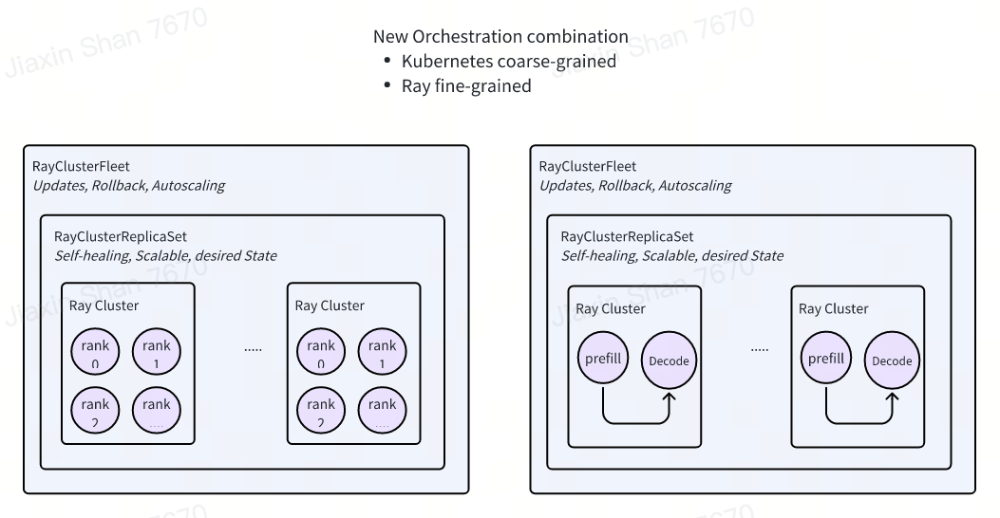

.. _distributed_inference:

====================
Multi-Node Inference
====================

Distributed inference refers to the technique of splitting and processing LLM model across multiple nodes or devices.
This approach is particularly useful for large models that cannot fit into the memory of a single machine.
This solution relies on KubeRay to orchestrate the Ray Clusters.

Key API Design
--------------

In the landscape of distributed computing, the need for efficient orchestration of multi-node inference tasks has become paramount.
Kubernetes has established itself as a leading platform for managing containerized applications, offering robust resource management and scalability.
On the other hand, Ray has emerged as a powerful framework for building and running distributed applications, particularly well-suited for handling complex machine learning workflows.
However, the existing approaches to orchestration often fall short in terms of flexibility and simplicity.
Kubernetes operators, while powerful, can become overly complex when dealing with fine-grained orchestration of distributed applications.
Ray, although excellent for internal task scheduling and resource management, lacks the broader resource orchestration capabilities provided by Kubernetes.

To address these challenges, we propose a new orchestration approach that synergizes the strengths of both Kubernetes and Ray.
This approach leverages Ray for ``internal fine-grained application orchestration``, allowing users to utilize Ray's APIs for distributed computation Simultaneously,
Kubernetes will handle the overall application resource orchestration, focusing on ``coarse-grained resource allocation`` and environment configuration.
This division of responsibilities simplifies the design of Kubernetes operators and enhances the overall flexibility and efficiency of the orchestration process.

We introduce two key APIs for RayCluster Management, it's ``RayClusterReplicaSet`` and ``RayClusterFleet``.
It's similar like Kubernetes core concept ``ReplicaSet`` and ``Deployment``. Most of the time, you only need to use ``RayClusterFleet``.

- Ray Framework Focus: In this model, Ray is emphasized solely for its role in intra-application orchestration. Each application instance corresponds to a single Ray Cluster, and multiple service instances of an application equate to multiple Ray Clusters. This ensures that Ray handles the distributed nature of the application internally without interference from external orchestration systems.

- Kubernetes Layer: Kubernetes operates at the outer layer, responsible for initiating Ray Clusters and managing standard Kubernetes functionalities such as autoscaling and rolling updates. The Kubernetes layer doesn't orchestrate the roles inside the application anymore. These features are well-established within the Kubernetes ecosystem, ensuring robust and reliable resource management, scaling, and update processes. By leveraging Kubernetes for these operations, we can achieve a seamless integration of Ray’s distributed computing capabilities with Kubernetes’ mature operational management.

- Service Encapsulation and Mapping: At a higher level, services are encapsulated in a manner analogous to Kubernetes Deployments and ReplicaSets. The key difference lies in the mapping: instead of Pods, we now have Ray Clusters representing application instances. Traditionally, a single Pod would constitute an application instance; however, in this distributed model, a Ray Cluster serves this purpose, encapsulating the complexity of distributed execution within itself.

.. attention::
    We already submit our ideas to KubeRay community. Hopefully, we can merge into the repo pretty soon.

Workloads Examples
------------------

vLLM Custom Build
^^^^^^^^^^^^^^^^^

In order to run this example, we did minor changes to official vLLM distribution. You can skip this setup by using our built image ``aibrix/vllm-openai:v0.6.1.post2-distributed``.
If you like to build your own image, you can follow steps here.

.. code-block:: Dockerfile

    FROM vllm/vllm-openai:v0.6.1.post2
    RUN apt update && apt install -y wget # important for future healthcheck
    RUN pip3 install ray[default] # important for future healthcheck
    ENTRYPOINT [""]

.. code-block:: bash

    docker build -t aibrix/vllm-openai:v0.6.1.post2-distributed .

RayClusterReplicaSet
^^^^^^^^^^^^^^^^^^^^

.. code-block:: yaml

    apiVersion: orchestration.aibrix.ai/v1alpha1
    kind: RayClusterFleet
    metadata:
      labels:
        app.kubernetes.io/name: aibrix
        app.kubernetes.io/managed-by: kustomize
      name: facebook-opt-13b
    spec:
      replicas: 1
      selector:
        matchLabels:
          model.aibrix.ai/name: facebook-opt-13b
      strategy:
        rollingUpdate:
          maxSurge: 25%
          maxUnavailable: 25%
        type: RollingUpdate
      template:
        metadata:
          labels:
            model.aibrix.ai/name: facebook-opt-13b
          annotations:
            ray.io/overwrite-container-cmd: "true"
        spec:
          rayVersion: '2.10.0' # should match the Ray version in the image of the containers
          headGroupSpec:
            rayStartParams:
              dashboard-host: '0.0.0.0'
            template:
              spec:
                containers:
                  - name: ray-head
                    image: aibrix/vllm-openai:v0.6.1.post2-distributed
                    ports:
                      - containerPort: 6379
                        name: gcs-server
                      - containerPort: 8265
                        name: dashboard
                      - containerPort: 10001
                        name: client
                      - containerPort: 8000
                        name: service
                    command: ["/bin/bash", "-lc", "--"]
                    # Starting from v1.1.0, KubeRay injects the environment variable `KUBERAY_GEN_RAY_START_CMD`
                    # into the Ray container. This variable can be used to retrieve the generated Ray start command.
                    # Note that this environment variable does not include the `ulimit` command.
                    args: ["ulimit -n 65536; echo head; ray start --head --num-cpus=8 --num-gpus=2 --dashboard-host=0.0.0.0 --metrics-export-port=8080 --dashboard-agent-listen-port=52365; vllm serve /models/llama-2-7b-hf/ --served-model-name meta-llama/llama-2-7b-hf --tensor-parallel-size 2 --distributed-executor-backend ray"]
                    resources:
                      limits:
                        cpu: "8000m"
                        nvidia.com/gpu: 2
                      requests:
                        cpu: "8000m"
                        nvidia.com/gpu: 2
