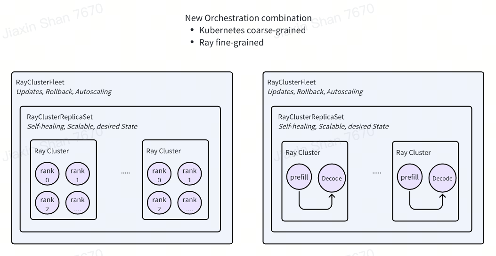

.. _distributed_inference:

====================
Multi-Node Inference
====================

Distributed inference splits and processes an LLM across multiple nodes or devices.
This approach is needed for large models that exceed the memory capacity of a single machine.

AIBrix provides two orchestration paths for multi-node inference:

1. Ray-based Orchestration (``RayClusterFleet`` / ``RayClusterReplicaSet``): Uses KubeRay for intra-application worker placement and coordination, with Kubernetes managing replica scaling and rollouts.
2. Native PodSet Orchestration (``StormService``): Kubernetes-native multi-role and multi-node grouping via ``podGroupSize`` without requiring KubeRay.

.. contents:: On this page
   :local:
   :depth: 2

Choosing an Orchestration Abstraction
--------------------------------------

Operators can pick the abstraction matching their deployment topology and infrastructure setup:

.. list-table::
   :widths: 25 35 40
   :header-rows: 1

   * - Abstraction
     - Infrastructure Requirement
     - Best Suited For
   * - RayClusterFleet
     - KubeRay operator installed
     - Standard multi-node vLLM deployments where Ray handles process placement and worker coordination.
   * - StormService
     - Native Kubernetes (no KubeRay required)
     - Prefill-Decode (PD) disaggregated setups, custom multi-role architectures, or direct engine-native distributed backends (like SGLang or vLLM with MPI/NCCL and RDMA networking).

KubeRay Orchestration (RayClusterFleet)
----------------------------------------

In distributed computing, managing multi-node inference requires coordination at two layers: fine-grained task execution inside the cluster, and standard operational management from Kubernetes.

Ray handles intra-application task scheduling and worker communication well, but relies on external systems for cluster lifecycle operations. Kubernetes excels at container scheduling, autoscaling, and rolling updates.

AIBrix combines both: Ray handles internal distributed computation, while Kubernetes manages replica lifecycle and environment setup.

Two key APIs manage Ray clusters: ``RayClusterReplicaSet`` and ``RayClusterFleet``.
These mirror Kubernetes ``ReplicaSet`` and ``Deployment`` patterns. In most cases, ``RayClusterFleet`` is the primary resource to configure.

- Ray Framework Focus: Ray handles intra-application orchestration. Each application instance corresponds to a single Ray cluster.
- Kubernetes Layer: Kubernetes operates at the outer layer, handling Ray cluster creation, autoscaling, and rolling updates.
- Service Encapsulation: Services map to Ray clusters representing application instances rather than single pods.

.. attention::
    We already submitted our ideas to the KubeRay community.

RayClusterFleet Example
^^^^^^^^^^^^^^^^^^^^^^^

Below is a ``RayClusterFleet`` example deploying a two-node distributed inference cluster:

.. literalinclude:: ../../../samples/distributed/fleet-two-node.yaml
   :language: yaml

Native PodSet Orchestration (StormService)
------------------------------------------

For deployments that do not run KubeRay, or for disaggregated architectures requiring explicit role separation (such as separate Prefill and Decode roles), AIBrix provides native multi-node grouping via ``StormService``.

Using ``podGroupSize`` within a role template, ``StormService`` allocates multiple synchronized pods for each replica instance and injects deterministic distributed environment variables (such as ``$POD_GROUP_INDEX`` and ``$PODSET_NAME``). This enables engine-native Tensor Parallelism (TP) across multiple nodes.

Key capabilities:

- No external dependencies: Runs directly on Kubernetes without installing KubeRay.
- Multi-Role and Disaggregation support: Allows defining separate roles (such as routing, prefill, and decode) with distinct resource profiles and pod group sizes within a single service definition.
- Deterministic rank and discovery: Pods within a group discover peers via predictable headless service DNS entries (such as ``${PODSET_NAME}-0.${STORM_SERVICE_NAME}``).

StormService Multi-Node TP Sample
^^^^^^^^^^^^^^^^^^^^^^^^^^^^^^^^^^

Below is a complete multi-node Tensor Parallelism example with Prefill/Decode disaggregation (2-node prefill and 2-node decode with ``podGroupSize: 2`` and ``--nnodes 2 --tp-size 2``):

.. literalinclude:: ../../../samples/disaggregation/sglang/tp-1p1d.yaml
   :language: yaml

Container Image Requirements
-----------------------------

.. attention::

    Starting from v0.6.6, essential packages to run distributed inference with the official vLLM container image distribution are included out of the box.
    If you use earlier versions, follow the guidance below to build a compatible image.

If you are using an earlier vLLM version, you have two options:

* Use our built image ``aibrix/vllm-openai:v0.6.1.post2-distributed``.
* Build your own image following these steps:

.. code-block:: Dockerfile

    FROM vllm/vllm-openai:v0.6.1.post2
    RUN apt update && apt install -y wget
    RUN pip3 install ray[default]
    ENTRYPOINT [""]

.. code-block:: bash

    docker build -t aibrix/vllm-openai:v0.6.1.post2-distributed .
