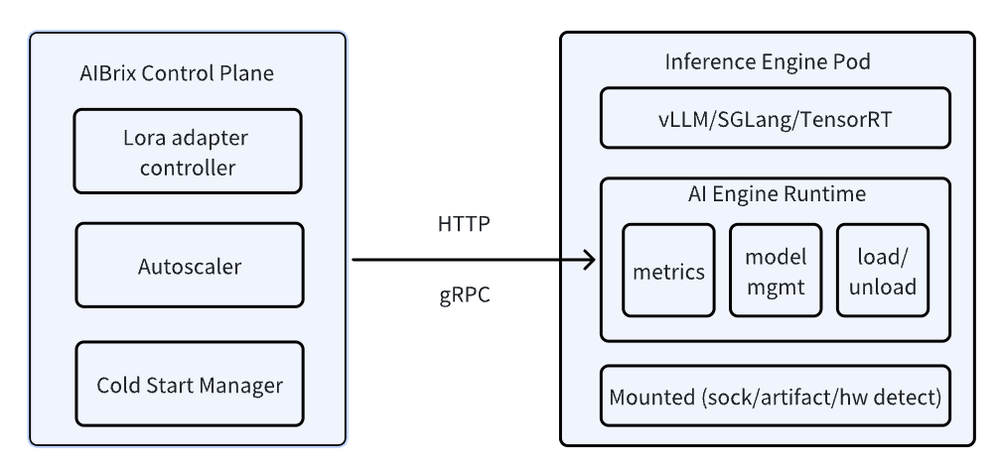

.. _ai_runtime:

=================
AI Engine Runtime
=================

AI Engine Runtime is a Unified Management Layer for Inference Containers. It is a versatile sidecar enabling metric standardization, model downloading, and local model management. 
The AI Runtime hides various implementation details on the inference engine side, providing a universal method to guide model download and management, as well as expose inference monitoring metrics.

Currently, this component is mainly designed for the lora model deployment and multi-engine support. You do not necessarily need to install the runtime for most of the cases.
As we expand the support for more inference engines and enrich the features for cold start management etc, the runtime will be more useful.

Introduction
------------

AI Engine Runtime serves as an essential bridge between the AIBrix Control Plane and inference engine pods, enabling model management, engine configuration, observability, and vendor-agnostic engine support.

- **API for Control Plane Integration**: It ensures seamless communication between the control plane and inference pods. This allows components like the LoRA adapter controller, autoscaler, and cold start manager to interact dynamically with inference containers, managing resources in a cloud-native way.
- **Abstracting Vendor-Specific Inference Engines**: AI Engine Runtime is designed to work with diverse inference engines, including most popular ones. However, the engine api are all different. Instead of tightly coupling with any specific engine, AIRuntime abstracts key operations like model loading/unloading, adapter configuration, and performance monitoring, allowing new inference backends to be integrated with minimal friction.
- **Observability**: It provides a unified interface for monitoring across different inference engines, allowing for consistent performance tracking and troubleshooting.

.. attention::
    This runtime is different from Istio sidecar. Data plane traffic won't go through this runtime, it just provide some management capabilities for control plane interaction. 

Installation
------------

By default, user does not need to install runtime seperately. The guidance for the base model deployment has the runtime enabled. You can enable the
runtime by adding the following to your deployment yaml. In future, we will provide a more convenient way to enable the runtime like mutating webhook.

.. code-block:: yaml

      - name: aibrix-runtime
        image: aibrix/runtime:v0.1.0
        command:
        - aibrix_runtime
        - --port
        - "8080"
        ports:
        - containerPort: 8080
          protocol: TCP
        volumeMounts:
        - mountPath: /models
          name: model-hostpath
      volumes:
      - name: model-hostpath
        hostPath:
          path: /root/models
          type: DirectoryOrCreate

If you like to use the runtime for other cases, you can install it by the following command.

.. attention:: 

    ``python3 -m pip install aibrix``

    If you want to use nightly version, you can install from code.

    ``cd $AIBRIX_HOME/python/aibrix && python3 -m pip install -e .``

Metric Standardization
----------------------

Different inference engines will expose different metrics, and AI Runtime will standardize them.

Define the information related to the inference engine side in the container environment variables. For example, if ``vLLM`` provides metrics services on ``http://localhost:8000/metrics``, launch the AI Runtime Server by the following command:

.. code-block:: bash

    INFERENCE_ENGINE=vllm INFERENCE_ENGINE_ENDPOINT="http://localhost:8000" aibrix_runtime --port 8080

And runtime will provide unified inference metrics on ``http://localhost:8080/metrics``. Right now, you notice that the metrics are exact same as the vllm metrics. This is subject to change in the future once more engines are supported.
Unified metrics help to standardize the metrics for different inference engines and also components like autoscaler, etc.

.. code-block:: bash

    # TYPE vllm:cache_config_info gauge
    vllm:cache_config_info{block_size="16",cache_dtype="auto",calculate_kv_scales="False",cpu_offload_gb="0",enable_prefix_caching="False",gpu_memory_utilization="0.9",is_attention_free="False",num_cpu_blocks="9362",num_gpu_blocks="81767",num_gpu_blocks_override="None",sliding_window="None",swap_space_bytes="4294967296"} 1.0
    # HELP vllm:num_requests_running Number of requests currently running on GPU.
    # TYPE vllm:num_requests_running gauge
    vllm:num_requests_running{model_name="Qwen/Qwen2.5-Coder-1.5B-Instruct"} 0.0
    # HELP vllm:num_requests_swapped Number of requests swapped to CPU.
    # TYPE vllm:num_requests_swapped gauge
    vllm:num_requests_swapped{model_name="Qwen/Qwen2.5-Coder-1.5B-Instruct"} 0.0
    # HELP vllm:num_requests_waiting Number of requests waiting to be processed.
    # TYPE vllm:num_requests_waiting gauge
    vllm:num_requests_waiting{model_name="Qwen/Qwen2.5-Coder-1.5B-Instruct"} 0.0
    # HELP vllm:gpu_cache_usage_perc GPU KV-cache usage. 1 means 100 percent usage.
    # TYPE vllm:gpu_cache_usage_perc gauge
    vllm:gpu_cache_usage_perc{model_name="Qwen/Qwen2.5-Coder-1.5B-Instruct"} 0.0
    # HELP vllm:cpu_cache_usage_perc CPU KV-cache usage. 1 means 100 percent usage.
    # TYPE vllm:cpu_cache_usage_perc gauge
    vllm:cpu_cache_usage_perc{model_name="Qwen/Qwen2.5-Coder-1.5B-Instruct"} 0.0
    # HELP vllm:cpu_prefix_cache_hit_rate CPU prefix cache block hit rate.
    # TYPE vllm:cpu_prefix_cache_hit_rate gauge
    vllm:cpu_prefix_cache_hit_rate{model_name="Qwen/Qwen2.5-Coder-1.5B-Instruct"} -1.0
    # HELP vllm:gpu_prefix_cache_hit_rate GPU prefix cache block hit rate.
    # TYPE vllm:gpu_prefix_cache_hit_rate gauge
    vllm:gpu_prefix_cache_hit_rate{model_name="Qwen/Qwen2.5-Coder-1.5B-Instruct"} -1.0
    # HELP vllm:lora_requests_info Running stats on lora requests.
    # TYPE vllm:lora_requests_info gauge
    vllm:lora_requests_info{max_lora="0",running_lora_adapters="",waiting_lora_adapters=""} 1.7382173358407154e+09
    # HELP vllm:num_preemptions_total Cumulative number of preemption from the engine.
    # TYPE vllm:num_preemptions_total counter
    vllm:num_preemptions_total{model_name="Qwen/Qwen2.5-Coder-1.5B-Instruct"} 0.0
    # HELP vllm:prompt_tokens_total Number of prefill tokens processed.
    # TYPE vllm:prompt_tokens_total counter
    vllm:prompt_tokens_total{model_name="Qwen/Qwen2.5-Coder-1.5B-Instruct"} 148.0
    # HELP vllm:generation_tokens_total Number of generation tokens processed.
    # TYPE vllm:generation_tokens_total counter
    vllm:generation_tokens_total{model_name="Qwen/Qwen2.5-Coder-1.5B-Instruct"} 955.0
    # HELP vllm:request_success_total Count of successfully processed requests.
    # TYPE vllm:request_success_total counter
    vllm:request_success_total{finished_reason="stop",model_name="Qwen/Qwen2.5-Coder-1.5B-Instruct"} 4.0
    # HELP vllm:iteration_tokens_total Histogram of number of tokens per engine_step.
    # TYPE vllm:iteration_tokens_total histogram
    vllm:iteration_tokens_total_sum{model_name="Qwen/Qwen2.5-Coder-1.5B-Instruct"} 1103.0
    vllm:iteration_tokens_total_bucket{le="1.0",model_name="Qwen/Qwen2.5-Coder-1.5B-Instruct"} 994.0
    vllm:iteration_tokens_total_bucket{le="2.0",model_name="Qwen/Qwen2.5-Coder-1.5B-Instruct"} 994.0
    vllm:iteration_tokens_total_bucket{le="4.0",model_name="Qwen/Qwen2.5-Coder-1.5B-Instruct"} 994.0
    vllm:iteration_tokens_total_bucket{le="8.0",model_name="Qwen/Qwen2.5-Coder-1.5B-Instruct"} 994.0
    vllm:iteration_tokens_total_bucket{le="16.0",model_name="Qwen/Qwen2.5-Coder-1.5B-Instruct"} 994.0
    vllm:iteration_tokens_total_bucket{le="24.0",model_name="Qwen/Qwen2.5-Coder-1.5B-Instruct"} 994.0
    vllm:iteration_tokens_total_bucket{le="32.0",model_name="Qwen/Qwen2.5-Coder-1.5B-Instruct"} 994.0
    vllm:iteration_tokens_total_bucket{le="40.0",model_name="Qwen/Qwen2.5-Coder-1.5B-Instruct"} 998.0
    vllm:iteration_tokens_total_bucket{le="48.0",model_name="Qwen/Qwen2.5-Coder-1.5B-Instruct"} 998.0
    vllm:iteration_tokens_total_bucket{le="56.0",model_name="Qwen/Qwen2.5-Coder-1.5B-Instruct"} 998.0
    vllm:iteration_tokens_total_bucket{le="64.0",model_name="Qwen/Qwen2.5-Coder-1.5B-Instruct"} 998.0
    vllm:iteration_tokens_total_bucket{le="72.0",model_name="Qwen/Qwen2.5-Coder-1.5B-Instruct"} 998.0
    vllm:iteration_tokens_total_bucket{le="80.0",model_name="Qwen/Qwen2.5-Coder-1.5B-Instruct"} 998.0
    vllm:iteration_tokens_total_bucket{le="88.0",model_name="Qwen/Qwen2.5-Coder-1.5B-Instruct"} 998.0
    vllm:iteration_tokens_total_bucket{le="96.0",model_name="Qwen/Qwen2.5-Coder-1.5B-Instruct"} 998.0

.. attention::
    Since vLLM is the only supported engine for now, we didn't use vendor-agnostic metrics. This is subject to change in the future once more engines are supported..

Model Downloading
-----------------

The AI Engine Runtime supports downloading models from multiple remote sources, including HuggingFace, S3, and TOS.
This is extremely useful when the control plane needs to interact with the pod to dynamically load new models.

Download From HuggingFace
^^^^^^^^^^^^^^^^^^^^^^^^^^
First Define the necessary environment variables for the HuggingFace model.

.. code-block:: bash

    # General settings
    export DOWNLOADER_ALLOW_FILE_SUFFIX="json, safetensors"
    export DOWNLOADER_NUM_THREADS=16
    # HuggingFace settings
    export HF_ENDPOINT=https://hf-mirror.com  # set it when env is in CN region

Then use AI Engine Runtime to download the model from HuggingFace:

.. code-block:: bash

    python -m aibrix.downloader \
        --model-uri deepseek-ai/deepseek-coder-6.7b-instruct \
        --local-dir /tmp/aibrix/models_hf/

Download From S3
^^^^^^^^^^^^^^^^^
First Define the necessary environment variables for the S3 model.

.. code-block:: bash

    # General settings
    export DOWNLOADER_ALLOW_FILE_SUFFIX="json, safetensors"
    export DOWNLOADER_NUM_THREADS=16
    # AWS settings
    export AWS_ACCESS_KEY_ID=<INPUT YOUR AWS ACCESS KEY ID>
    export AWS_SECRET_ACCESS_KEY=<INPUT YOUR AWS SECRET ACCESS KEY>
    export AWS_ENDPOINT_URL=<INPUT YOUR AWS ENDPOINT URL> # e.g. https://s3.us-west-2.amazonaws.com
    export AWS_REGION=<INPUT YOUR AWS REGION> # e.g. us-west-2

Then use AI Runtime to download the model from AWS S3:

.. code-block:: bash

    python -m aibrix.downloader \
        --model-uri s3://aibrix-model-artifacts/deepseek-coder-6.7b-instruct/ \
        --local-dir /tmp/aibrix/models_s3/
    

Download From TOS
^^^^^^^^^^^^^^^^^
First Define the necessary environment variables for the TOS model.

.. code-block:: bash

    # General settings
    export DOWNLOADER_ALLOW_FILE_SUFFIX="json, safetensors"
    export DOWNLOADER_NUM_THREADS=16
    # AWS settings
    export TOS_ACCESS_KEY=<INPUT YOUR TOS ACCESS KEY>
    export TOS_SECRET_KEY=<INPUT YOUR TOS SECRET KEY>
    export TOS_ENDPOINT=<INPUT YOUR TOS ENDPOINT> # e.g. https://tos-s3-cn-beijing.volces.com
    export TOS_REGION=<INPUT YOUR TOS REGION> # e..g cn-beijing

Then use AI Runtime to download the model from TOS:

.. code-block:: bash

    python -m aibrix.downloader \
        --model-uri tos://aibrix-model-artifacts/deepseek-coder-6.7b-instruct/ \
        --local-dir /tmp/aibrix/models_tos/

Model Configuration API
-----------------------

.. attention::
    this needs the engine to starts with `--enable-lora` and env `export VLLM_ALLOW_RUNTIME_LORA_UPDATING=true` enabled.
    You can check `Dynamically serving LoRA Adapters <https://docs.vllm.ai/en/latest/features/lora.html#dynamically-serving-lora-adapters>`_ for more details.

Let's assume you already have a base model and runtime deployed and you want to load a LoRA adapter to it.

.. code-block:: bash

    # start the engine
    VLLM_ALLOW_RUNTIME_LORA_UPDATING=true vllm serve Qwen/Qwen2.5-Coder-1.5B-Instruct --enable-lora
    # start the runtime
    INFERENCE_ENGINE=vllm INFERENCE_ENGINE_ENDPOINT="http://localhost:8000" aibrix_runtime --port 8080

.. code-block:: bash

    curl -X POST http://localhost:8080/v1/lora_adapter/load \
    -H "Content-Type: application/json" \
    -d '{"lora_name": "lora-2", "lora_path": "bharati2324/Qwen2.5-1.5B-Instruct-Code-LoRA-r16v2"}'

.. code-block:: bash

    curl -X POST http://localhost:8080/v1/lora_adapter/unload \
    -H "Content-Type: application/json" \
    -d '{"lora_name": "lora-1"}'

.. code-block:: bash

    curl -X GET  http://localhost:8000/v1/models | jq
    {
        "object": "list",
        "data": [
            {
                "id": "Qwen/Qwen2.5-Coder-1.5B-Instruct",
                "object": "model",
                "created": 1738218097,
                "owned_by": "vllm",
                "root": "Qwen/Qwen2.5-Coder-1.5B-Instruct",
                "parent": null,
                "max_model_len": 32768,
                "permission": [
                    {
                    "id": "modelperm-c2e9860095b745b6b8be7133c5ab1fcf",
                    "object": "model_permission",
                    "created": 1738218097,
                    "allow_create_engine": false,
                    "allow_sampling": true,
                    "allow_logprobs": true,
                    "allow_search_indices": false,
                    "allow_view": true,
                    "allow_fine_tuning": false,
                    "organization": "*",
                    "group": null,
                    "is_blocking": false
                    }
                ]
            },
            {
                "id": "lora-1",
                "object": "model",
                "created": 1738218097,
                "owned_by": "vllm",
                "root": "bharati2324/Qwen2.5-1.5B-Instruct-Code-LoRA-r16v2",
                "parent": "Qwen/Qwen2.5-Coder-1.5B-Instruct",
                "max_model_len": null,
                "permission": [
                    {
                    "id": "modelperm-c21d06b59af0435292c70cd612e68b01",
                    "object": "model_permission",
                    "created": 1738218097,
                    "allow_create_engine": false,
                    "allow_sampling": true,
                    "allow_logprobs": true,
                    "allow_search_indices": false,
                    "allow_view": true,
                    "allow_fine_tuning": false,
                    "organization": "*",
                    "group": null,
                    "is_blocking": false
                    }
                ]
            },
            {
                "id": "lora-2",
                "object": "model",
                "created": 1738218097,
                "owned_by": "vllm",
                "root": "bharati2324/Qwen2.5-1.5B-Instruct-Code-LoRA-r16v2",
                "parent": "Qwen/Qwen2.5-Coder-1.5B-Instruct",
                "max_model_len": null,
                "permission": [
                    {
                    "id": "modelperm-bf2af850171242f7a9f4ccd9ecd313cd",
                    "object": "model_permission",
                    "created": 1738218097,
                    "allow_create_engine": false,
                    "allow_sampling": true,
                    "allow_logprobs": true,
                    "allow_search_indices": false,
                    "allow_view": true,
                    "allow_fine_tuning": false,
                    "organization": "*",
                    "group": null,
                    "is_blocking": false
                    }
                ]
            }
        ]
    }

