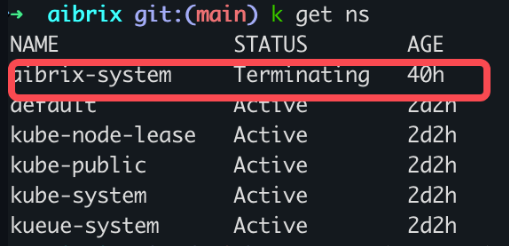
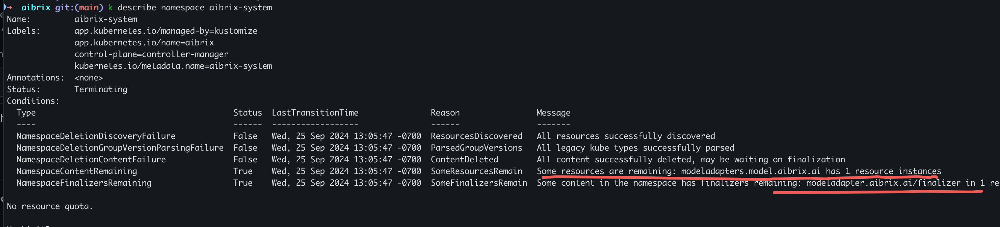
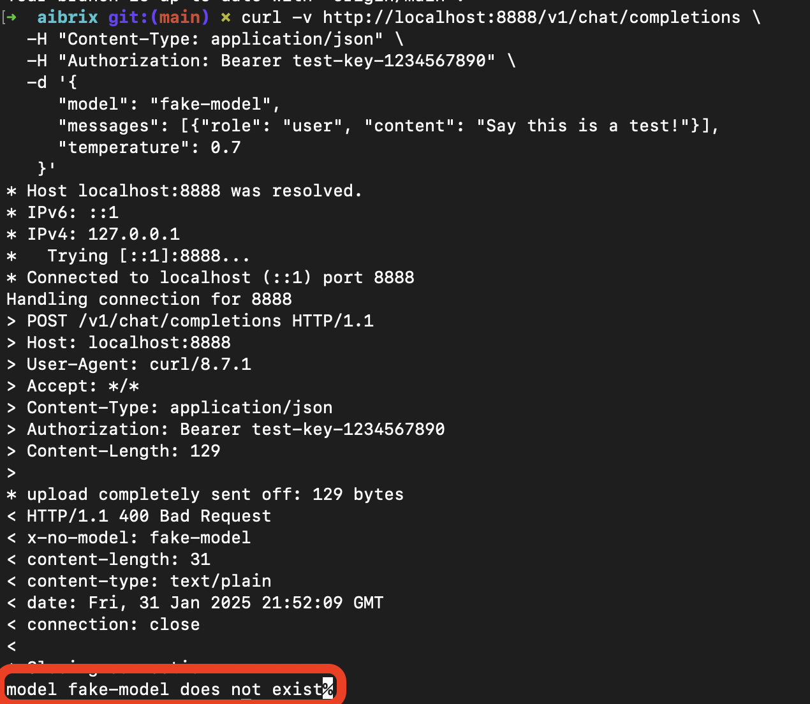

.. _faq:

===
FAQ
===

FAQ - Installation
------------------

Failed to delete the AIBrix
------------------

In this case, you just need to find the model adapter, edit the object, and remove the ``finalizer`` pair. the pod would be deleted automatically.

Gateway error messages
------------------

* model does not exist

* routing strategy is incorrect

* no ready pods

