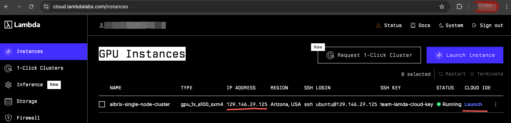

.. _lambda_cloud:

============
Lambda Cloud
============

This guide provides a step-by-step tutorial to deploy AIBrix on a single-node Lambda instance for testing purposes. The setup includes installing dependencies, verifying the installation, setting up the cluster, and deploying AIBrix components.

Prerequisites
-------------

1. Get a Lambda Cloud instance
^^^^^^^^^^^^^^^^^^^^^^^^^^^^^^

You can follow `lambda cloud docs <https://docs.lambdalabs.com/>`_ to launch an instance.

After launching the instance, you can get the instance's IP address and ssh into the instance.

You can also enter the Jupyter notebook without managing SSH keys.

2. Clone AIBrix code base
^^^^^^^^^^^^^^^^^^^^^^^^^

Clone the AIBrix code base to your local machine:

.. code-block:: bash

    git clone https://github.com/vllm-project/aibrix.git
    cd aibrix

3. Install Dependencies
^^^^^^^^^^^^^^^^^^^^^^^

Run the following script to install the necessary dependencies including `nvkind`, `minikube`, `kubectl`, `Helm`, `Go`, and the `NVIDIA Container Toolkit`.

.. code-block:: bash

    bash hack/lambda-cloud/install.sh

**Summary:**

* Installs required system packages (`jq`, `Go`, `kubectl`, `kind`, `Helm`)
* Installs `nvkind` and `minikube` (custom Kubernetes-in-Docker with GPU support)
* Configures the NVIDIA Container Toolkit
* Updates Docker settings for GPU compatibility

.. figure::../../assets/images/cloud/lambda-cloud-installation.png
    :alt: lambda-cloud-installation
    :width: 70%
    :align: center

Once completed, restart your terminal or run:

.. code-block:: bash

    source ~/.bashrc

4. Verify GPU container runtime
^^^^^^^^^^^^^^^^^^^^^^^^^^^^^^^

The path for the following script assumes that you are in the root directory of the AIBrix repository.

Run the following script to ensure that the NVIDIA drivers and Docker integration are correctly configured:

.. code-block:: bash

    bash ./hack/lambda-cloud/verify.sh

**Summary:**

* Runs `nvidia-smi` to check GPU availability
* Runs a Docker container with NVIDIA runtime to verify GPU detection
* Ensures that GPU devices are accessible within containers

If all checks pass successfully like below, proceed to the next step.

.. figure::../../assets/images/cloud/lambda-cloud-verify-installation.png
    :alt: lambda-cloud-verify-installation
    :width: 70%
    :align: center

Setup Kubernetes Environments
-----------------------------

We provide two ways to set up the environment:

1. **Minikube** (Recommended): Minikube is the recommended option for local testing and development. It provides a stable, single-node Kubernetes cluster.
2. **Kind**: Kind can also be used, but due to the container-based nature of Kind clusters, we often observe that containers unexpectedly receive `SIGTERM` signals.(see `issue#683 <https://github.com/vllm-project/aibrix/issues/683>`_ and `issue#684 <https://github.com/vllm-project/aibrix/issues/684>`_).

.. attention::
    The root cause has not yet been fully determined. Therefore, we recommend using Minikube whenever possible for a more stable experience.

MiniKube
^^^^^^^^

1. Create a `minikube` Cluster
~~~~~~~~~~~~~~~~~~~~~~~~~~~~~~

First, ensure that your non-root user has `docker` permission:

.. code-block:: bash

    sudo usermod -aG docker $USER
    newgrp docker

Create a Kubernetes cluster using minikube:

.. code-block:: bash

    minikube start --driver=docker --container-runtime=docker --gpus=all --cpus=8 --memory=16g
    😄  minikube v1.35.0 on Ubuntu 22.04 (kvm/amd64)
    ✨  Using the docker driver based on user configuration
    📌  Using Docker driver with root privileges
    👍  Starting "minikube" primary control-plane node in "minikube" cluster
    🚜  Pulling base image v0.0.46 ...
    💾  Downloading Kubernetes v1.32.0 preload ...
        > preloaded-images-k8s-v18-v1...:  333.57 MiB / 333.57 MiB  100.00% 230.98
    🔥  Creating docker container (CPUs=8, Memory=16384MB) ...
    🐳  Preparing Kubernetes v1.32.0 on Docker 27.4.1 ...
        ▪ Generating certificates and keys ...
        ▪ Booting up control plane ...
        ▪ Configuring RBAC rules ...
    🔗  Configuring bridge CNI (Container Networking Interface) ...
    🔎  Verifying Kubernetes components...
        ▪ Using image nvcr.io/nvidia/k8s-device-plugin:v0.17.0
        ▪ Using image gcr.io/k8s-minikube/storage-provisioner:v5
    🌟  Enabled addons: storage-provisioner, nvidia-device-plugin, default-storageclass
    💡  kubectl not found. If you need it, try: 'minikube kubectl -- get pods -A'
    🏄  Done! kubectl is now configured to use "minikube" cluster and "default" namespace by default

.. note::
    1. If you meet problems setup the cluster and enable the GPU support, check `Using NVIDIA GPUs with minikube <https://minikube.sigs.k8s.io/docs/tutorials/nvidia/>`_ for more details.
    2. GPU operator will be automatially installed along with the cluster setup, we do not need to install it separately.

2. Enable LoadBalancer service in minikube
~~~~~~~~~~~~~~~~~~~~~~~~~~~~~~~~~~~~~~~~~~

Services of type LoadBalancer can be exposed via the `minikube tunnel` command. It must be run in a separate terminal window to keep the `LoadBalancer` running.
Check `LoadBalancer access <https://minikube.sigs.k8s.io/docs/handbook/accessing/>`_ for more details.

Run the tunnel in a separate terminal and do not close this window.

.. code-block:: bash

    minikube tunnel

    Password:
     Status:
     machine: minikube
     pid: 39087
     route: 10.96.0.0/12 -> 192.168.64.194
     minikube: Running
     services: [hello-minikube]
         errors:
       minikube: no errors
       router: no errors
       loadbalancer emulator: no errors

3. Delete the minikube cluster
~~~~~~~~~~~~~~~~~~~~~~~~~~~~~~

Once you've done testing, you can delete the `minikube` cluster:

.. code-block:: bash

    minikube delete

Kind
^^^^

1. Create a `nvkind` Cluster
~~~~~~~~~~~~~~~~~~~~~~~~~~~~~~~

Create a Kubernetes cluster using nvkind:

.. code-block:: bash

    nvkind cluster create --config-template=./hack/lambda-cloud/nvkind-cluster.yaml

This will set up a single-node cluster with GPU support. Make sure you see `Ready` status for the node:

.. code-block:: bash

    kubectl get nodes

2. Setup NVIDIA GPU Operator
~~~~~~~~~~~~~~~~~~~~~~~~~~~~

Run the following script to install the NVIDIA GPU Operator and configure the cloud provider:

.. code-block:: bash

    bash ./hack/lambda-cloud/setup.sh

**Summary:**

* Installs the NVIDIA GPU Operator using Helm
* Installs the Cloud Provider Kind (`cloud-provider-kind`)
* Runs `cloud-provider-kind` in the background for cloud integration

3. Delete Lambda Kind Cluster
~~~~~~~~~~~~~~~~~~~~~~~~~~~~~

Once you've done testing, you can delete the `nvkind` cluster:

.. code-block:: bash

    # get your cluster name
    kind get clusters

    kind delete clusters nvkind-7kx6v # nvkind-7kx6v is the cluster name in this example

Install AIBrix
--------------

Once the cluster is up and running, install AIBrix components:

**Install dependencies:**

.. code-block:: bash

    # install dependencies
    kubectl create -k "github.com/vllm-project/aibrix/config/dependency?ref=v0.2.1"

    # install core components
    kubectl create -k "github.com/vllm-project/aibrix/config/overlays/release?ref=v0.2.1"

Verify that the AIBrix components are installed successfully:

.. code-block:: bash

    kubectl get pods -n aibrix-system

Now, you can follow :doc:`../quickstart` to deploy your models.

Conclusion
----------
You have successfully deployed AIBrix on a single-node Lambda instance. This setup allows for efficient testing and debugging of AIBrix components in a local environment.

If you encounter issues, ensure that:

* The NVIDIA GPU Operator is correctly installed
* The cluster has GPU resources available (`kubectl describe nodes`)
* Docker and Kubernetes configurations match GPU compatibility requirements

Happy Testing!
