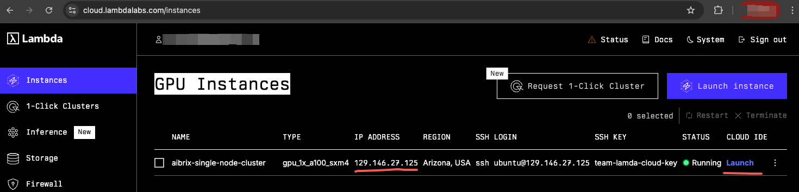

.. _lambda_cloud_installation:

=================================================
AIBrix Single-Node Deployment on Lambda Instances
=================================================

This guide provides a step-by-step tutorial to deploy AIBrix on a single-node Lambda instance for testing purposes. The setup includes installing dependencies, verifying the installation, setting up the cluster, and deploying AIBrix components.

Prerequisites
-------------

Before you begin, ensure you have the following:
* A `Lambda Clouds <https://lambdalabs.com/>`_ instance with single NVIDIA GPUs
* clone AIBrix code base

You can follow `lambda cloud docs <https://docs.lambdalabs.com/>`_ to launch an instance.

After launching the instance, you can get the instance's IP address and ssh into the instance.

.. figure::../assets/images/cloud/lambda-cloud-ssh.png
    :alt: lambda-cloud-ssh
    :width: 70%
    :align: center

Installation Steps
------------------

1. Install Dependencies
~~~~~~~~~~~~~~~~~~~~~~~

Run the following script to install the necessary dependencies including `nvkind`, `kubectl`, `Helm`, `Go`, and the `NVIDIA Container Toolkit`.

.. code-block:: bash

    bash hack/lambda-cloud/install.sh

**install.sh Summary:**
- Installs required system packages (`jq`, `Go`, `kubectl`, `kind`, `Helm`)
- Installs `nvkind` (custom Kubernetes-in-Docker with GPU support)
- Configures the NVIDIA Container Toolkit
- Updates Docker settings for GPU compatibility

.. figure::../assets/images/cloud/lambda-cloud-installation.png
    :alt: lambda-cloud-installation
    :width: 70%
    :align: center

Once completed, restart your terminal or run:

.. code-block:: bash

    source ~/.bashrc

2. Verify Installation
~~~~~~~~~~~~~~~~~~~~~~
Run the following script to ensure that the NVIDIA drivers and Docker integration are correctly configured:

.. code-block:: bash

    bash verify.sh

**verify.sh Summary:**
- Runs `nvidia-smi` to check GPU availability
- Runs a Docker container with NVIDIA runtime to verify GPU detection
- Ensures that GPU devices are accessible within containers

If all checks pass successfully like below, proceed to the next step.

.. figure::../assets/images/cloud/lambda-cloud-verify-installation.png
    :alt: lambda-cloud-verify-installation
    :width: 70%
    :align: center

3. Create an `nvkind` Cluster
~~~~~~~~~~~~~~~~~~~~~~~~~~~~~~~

Create a Kubernetes cluster using nvkind:

.. code-block:: bash

    nvkind cluster create --config-template=nvkind-cluster.yaml

This will set up a single-node cluster with GPU support. Make sure you see `Ready` status for the node:

.. code-block:: bash

    kubectl get nodes

4. Setup NVIDIA GPU Operator
~~~~~~~~~~~~~~~~~~~~~~~~~~~~

Run the following script to install the NVIDIA GPU Operator and configure the cloud provider:

.. code-block:: bash

    bash setup.sh

**setup.sh Summary:**
- Installs the NVIDIA GPU Operator using Helm
- Installs the Cloud Provider Kind (`cloud-provider-kind`)
- Runs `cloud-provider-kind` in the background for cloud integration

5. Install AIBrix
~~~~~~~~~~~~~~~~~
Once the cluster is up and running, install AIBrix components:

**Install dependencies:**

.. code-block:: bash

    # install dependencies
    kubectl create -k "github.com/aibrix/aibrix/config/dependency?ref=v0.2.0-rc.2"

    # install core components
    kubectl create -k "github.com/aibrix/aibrix/config/overlays/release?ref=v0.2.0-rc.2"

Verify that the AIBrix components are installed successfully:

.. code-block:: bash

    kubectl get pods -n aibrix-system

Conclusion
----------
You have successfully deployed AIBrix on a single-node Lambda instance. This setup allows for efficient testing and debugging of AIBrix components in a local environment.

If you encounter issues, ensure that:
- The NVIDIA GPU Operator is correctly installed
- The cluster has GPU resources available (`kubectl describe nodes`)
- Docker and Kubernetes configurations match GPU compatibility requirements

Happy Testing!
