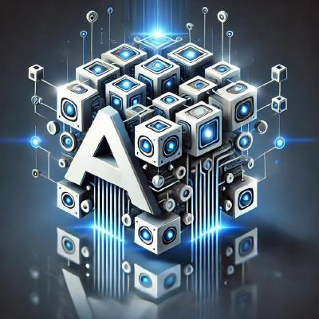

Welcome to AIBrix
=================

AIBrix is an open-source initiative designed to provide essential building blocks to construct scalable GenAI inference infrastructure. 
AIBrix delivers a cloud-native solution optimized for deploying, managing, and scaling large language model (LLM) inference, tailored specifically to enterprise needs.

Key features:

- **LLM Gateway and Routing**: Efficiently manage and direct traffic across multiple models and replicas.
- **High-Density LoRA Management**: Streamlined support for lightweight, low-rank adaptations of models.
- **Distributed Inference**: Scalable architecture to handle large workloads across multiple nodes.
- **LLM App-Tailored Autoscaler**: Dynamically scale inference resources based on real-time demand.
- **Unified AI Runtime**: A versatile sidecar enabling metric standardization, model downloading, and management.
- **Heterogeneous-GPU Inference**: Cost-effective SLO-driven LLM inference using heterogeneous GPUs.
- **GPU Hardware Failure Detection**: Proactive detection of GPU hardware issues.
- **KVCache Offloading and Cross-Engine KV Reuse**: High-Performance KVCache offloading framework supporting both naive KV offloading and cross-engine KV reuse.
- **Benchmark Tool**: A tool for measuring inference performance and resource efficiency.

Where to start
==============

.. grid:: 1 1 3 3
   :gutter: 3

   .. grid-item-card:: Beginner
      :class-card: sd-border-1

      New to AIBrix. Get one model serving.

      1. :doc:`getting_started/overview`
      2. :doc:`getting_started/quickstart`
      3. :doc:`getting_started/installation/installation`
      4. :doc:`features/gateway-plugins`

   .. grid-item-card:: Intermediate
      :class-card: sd-border-1

      Serving works. Make it efficient.

      1. :doc:`features/autoscaling/autoscaling`
      2. :doc:`features/lora-dynamic-loading`
      3. :doc:`features/kvcache-offloading`
      4. :doc:`production/observability`

   .. grid-item-card:: Advanced
      :class-card: sd-border-1

      Scale, cost, and latency targets.

      1. :doc:`features/pd-disaggregation`
      2. :doc:`features/multi-node-inference`
      3. :doc:`features/heterogeneous-gpu`
      4. :doc:`production/model-deployment`

Documentation
=============

.. toctree::
   :maxdepth: 1
   :caption: Getting Started

   getting_started/overview.rst
   getting_started/quickstart.rst
   getting_started/container-images.rst
   getting_started/installation/installation.rst
   getting_started/advanced-k8s-examples.rst
   getting_started/faq.rst

.. toctree::
   :maxdepth: 1
   :caption: Architecture

   designs/architecture.rst
   designs/aibrix-router.rst
   designs/aibrix-engine-runtime.rst
   designs/aibrix-autoscaler.rst
   designs/aibrix-kvcache-offloading-framework.rst
   designs/aibrix-stormservice.rst

.. toctree::
   :maxdepth: 1
   :caption: Gateway & Routing

   features/gateway-plugins.rst
   features/pd-disaggregation.rst
   features/semantic-router.rst

.. toctree::
   :maxdepth: 1
   :caption: Model Serving

   features/lora-dynamic-loading.rst
   features/multi-node-inference.rst
   features/multi-engine.rst
   features/heterogeneous-gpu.rst
   features/runtime.rst
   features/modelclaim.rst

.. toctree::
   :maxdepth: 1
   :caption: Scaling & Performance

   features/autoscaling/autoscaling.rst
   features/kvcache-offloading.rst
   features/kv-event-sync.rst

.. toctree::
   :maxdepth: 1
   :caption: Batch Inference

   features/batch-api.rst
   features/batch-model-deployment-templates.rst
   features/batch-resource-manager.rst

.. toctree::
   :maxdepth: 1
   :caption: Benchmark

   features/brixbench.rst
   features/benchmark-and-generator.rst

.. toctree::
   :maxdepth: 1
   :caption: Development

   development/development.rst
   development/release.rst

.. toctree::
   :maxdepth: 1
   :caption: Production Readiness

   production/gateway.rst
   production/model-deployment.rst
   production/console.rst
   production/observability.rst

.. toctree::
   :maxdepth: 1
   :caption: Community

   community/community.rst
   community/contribution.rst
   community/research.rst
